# Human Manual

## What This Pack Helps With

give AI builders a first durable OpenAI Agents workflow with tool boundaries, handoff checks, eval prompts, and recovery rules for multi-agent drift

## How To Use

1. Read `README.md`.
2. Load `AGENTS.md` or `CLAUDE.md`.
3. Run evals.
4. Use pitfall and risk files to recover from failure.

## What This Pack Does Not Do

- It does not replace upstream docs.
- It does not prove production readiness.
- It does not claim official endorsement.

## Doramagic Source Extract

# https://github.com/openai/openai-agents-python 项目说明书

生成时间：2026-05-11 16:45:26 UTC

## 目录

- [项目概述](#overview)
- [快速开始指南](#quickstart)
- [核心概念](#core-concepts)
- [Agent 核心框架](#agent-core)
- [工具系统](#tools)
- [MCP 协议集成](#mcp)
- [Agent 转交机制](#handoffs)
- [Guardrails 安全机制](#guardrails)
- [沙箱 Agent 概述](#sandbox-agent)
- [沙箱会话管理](#sandbox-session)

<a id='overview'></a>

## 项目概述

### 相关页面

相关主题：[快速开始指南](#quickstart), [核心概念](#core-concepts)

<details>
<summary>相关源码文件</summary>

以下源码文件用于生成本页说明：

- [README.md](https://github.com/openai/openai-agents-python/blob/main/README.md)
- [pyproject.toml](https://github.com/openai/openai-agents-python/blob/main/pyproject.toml)
- [src/agents/version.py](https://github.com/openai/openai-agents-python/blob/main/src/agents/version.py)
- [examples/sandbox/README.md](https://github.com/openai/openai-agents-python/blob/main/examples/sandbox/README.md)
- [examples/research_bot/README.md](https://github.com/openai/openai-agents-python/blob/main/examples/research_bot/README.md)
- [examples/mcp/tool_filter_example/README.md](https://github.com/openai/openai-agents-python/blob/main/examples/mcp/tool_filter_example/README.md)
</details>

# 项目概述

## 项目简介

OpenAI Agents Python SDK 是一个强大的 Python 多智能体（Multi-Agent）编排框架，专为构建复杂的人工智能工作流和应用而设计。该项目源自 OpenAI 的前沿研究成果，旨在为开发者提供一套完整的工具集，用于创建能够协同工作、共享信息、相互交接任务的智能代理系统。

该框架的核心价值在于其灵活性和可扩展性。它不仅支持单代理执行，还支持多代理架构，其中多个专业化的代理可以并行或顺序执行任务，通过**交接（Handoff）机制**实现复杂的业务流程自动化。开发者可以轻松创建自定义代理、定义工具、设置审批流程，并将其部署到各种沙箱执行环境中。

资料来源：[README.md]()

## 核心架构

### 系统组件

OpenAI Agents Python SDK 的架构由以下几个核心组件构成：

| 组件名称 | 功能描述 | 关键文件位置 |
|---------|---------|------------|
| **Runner** | 主运行引擎，负责协调代理执行流程 | `src/agents/run_internal/` |
| **Agent** | 智能代理基类，封装LLM调用和工具管理 | `src/agents/agent.py` |
| **Sandbox** | 隔离执行环境，提供安全的代码运行环境 | `src/agents/sandbox/` |
| **Handoffs** | 代理间交接机制，支持任务传递 | `src/agents/handoffs/` |
| **MCP Server** | Model Context Protocol 服务器集成 | `src/agents/mcp/server.py` |
| **Tools** | 可扩展的工具系统，支持自定义工具 | `src/agents/tools/` |

资料来源：[src/agents/run_internal/turn_resolution.py](), [src/agents/handoffs/history.py]()

### 架构层次图

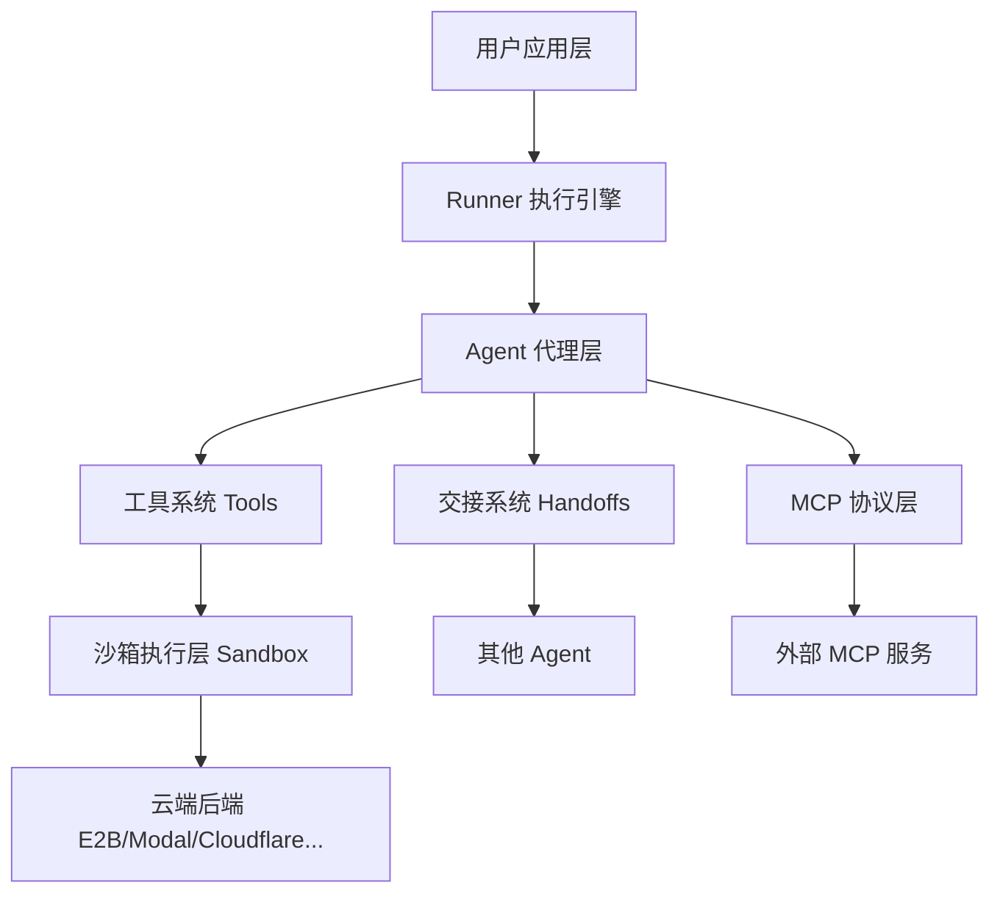

## 关键特性

### 1. 智能代理系统

代理（Agent）是框架的核心执行单元。每个代理包含：

- **系统提示词**：定义代理的角色和行为
- **工具集**：代理可调用的功能函数
- **交接配置**：与其他代理的协作关系
- **输出格式**：响应数据的结构定义

代理通过 `Runner` 统一调度，支持流式输出、增量响应和完整的结果返回。

### 2. 沙箱执行环境

框架提供了强大的沙箱（Sandbox）功能，用于隔离执行代码和敏感操作：


支持的沙箱后端包括：

| 后端名称 | 特点 | 典型用例 |
|---------|------|---------|
| **E2B** | 通用 bash 环境 | 通用代码执行 |
| **Modal** | Serverless 计算 | 长时间运行任务 |
| **Cloudflare** | 边缘计算 | 低延迟应用 |
| **Daytona** | 容器化执行 | 隔离测试环境 |
| **Vercel** | 云函数集成 | 快速部署 |
| **Blaxel** | 云存储挂载 | 数据密集型任务 |

资料来源：[examples/sandbox/README.md](), [examples/sandbox/extensions/README.md]()

### 3. 多代理协作与交接

交接（Handoff）机制允许代理之间传递控制权和上下文信息：

- **顺序交接**：一个代理完成后将任务交给下一个代理
- **并行执行**：多个代理同时处理不同子任务
- **上下文继承**：交接时自动传递对话历史和状态

```python
# 典型的交接流程
agent_a -> (handoff) -> agent_b -> (handoff) -> agent_c
```

资料来源：[src/agents/handoffs/history.py]()

### 4. MCP 协议支持

框架完整支持 Model Context Protocol (MCP)，允许代理与外部 MCP 服务器通信：

- 资源管理（Resources）
- 工具调用（Tools）
- 提示模板（Prompts）
- 资源模板（Resource Templates）

资料来源：[src/agents/mcp/server.py]()

### 5. 人机协作与审批

框架内置了完善的人工介入（Human-in-the-Loop）机制：

- **审批门控**：代理在执行敏感操作前等待人工批准
- **中断恢复**：人工审批后可从中断点恢复执行
- **自动模式**：支持无干预的自动化运行

资料来源：[examples/mcp/tool_filter_example/README.md]()

## 应用场景

### 研究助手

框架可用于构建复杂的研究代理系统：

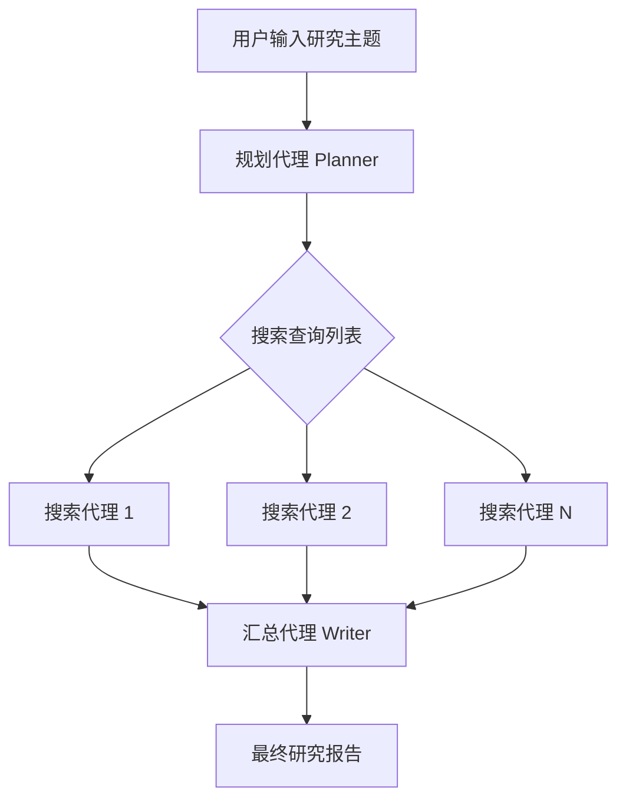

资料来源：[examples/research_bot/README.md]()

### 金融研究代理

专业化的金融分析工作流，包括：

- 财务数据分析
- 风险评估分析
- 基础面分析
- 投资报告生成

资料来源：[examples/financial_research_agent/README.md]()

### 医疗支持系统

复杂的医疗信息查询和验证系统，支持：

- 保险福利查询
- 先前授权检查
- 医疗政策分析
- 记忆回顾机制

资料来源：[examples/sandbox/healthcare_support/README.md]()

## 快速开始

### 环境要求

- Python 3.10+
- OpenAI API Key

### 安装方式

```bash
# 基础安装
uv sync

# 包含可选依赖的完整安装
uv sync --extra blaxel --extra modal --extra vercel
```

### 基本使用示例

```python
from agents import Agent, Runner

agent = Agent(name="助手", instructions="你是一个有帮助的助手")

result = Runner.run_sync(agent, "你好，请介绍一下你自己")
print(result.final_output)
```

资料来源：[pyproject.toml]()

## 项目结构

```
openai-agents-python/
├── src/agents/              # 核心源代码
│   ├── agent.py            # 代理基类
│   ├── runner.py           # 执行引擎
│   ├── handoffs/           # 交接系统
│   ├── sandbox/            # 沙箱实现
│   ├── mcp/                # MCP 协议支持
│   └── tools/              # 工具系统
├── examples/               # 示例应用
│   ├── sandbox/           # 沙箱示例
│   ├── research_bot/      # 研究代理示例
│   └── mcp/               # MCP 使用示例
└── README.md              # 项目文档
```

## 版本信息

当前版本定义在 `src/agents/version.py` 中，采用语义化版本管理。

资料来源：[src/agents/version.py]()

## 总结

OpenAI Agents Python SDK 代表了现代 AI 应用开发的新范式。它通过提供：

- **统一的代理抽象**：简化复杂 AI 工作流的构建
- **灵活的沙箱执行**：确保代码安全隔离运行
- **强大的协作机制**：支持多代理并行和顺序执行
- **完善的协议支持**：无缝集成 MCP 等开放标准

使开发者能够快速构建生产级别的人工智能应用，无论是简单的问答系统还是复杂的企业级工作流自动化。

资料来源：[README.md](), [examples/sandbox/README.md]()

---

<a id='quickstart'></a>

## 快速开始指南

### 相关页面

相关主题：[项目概述](#overview), [Agent 核心框架](#agent-core)

<details>
<summary>相关源码文件</summary>

以下源码文件用于生成本页说明：

- [examples/sandbox/README.md](https://github.com/openai/openai-agents-python/blob/main/examples/sandbox/README.md)
- [examples/research_bot/README.md](https://github.com/openai/openai-agents-python/blob/main/examples/research_bot/README.md)
- [examples/mcp/streamable_http_remote_example/README.md](https://github.com/openai/openai-agents-python/blob/main/examples/mcp/streamable_http_remote_example/README.md)
- [examples/mcp/tool_filter_example/README.md](https://github.com/openai/openai-agents-python/blob/main/examples/mcp/tool_filter_example/README.md)
- [examples/model_providers/README.md](https://github.com/openai/openai-agents-python/blob/main/examples/model_providers/README.md)
- [examples/sandbox/healthcare_support/README.md](https://github.com/openai/openai-agents-python/blob/main/examples/sandbox/healthcare_support/README.md)
</details>

# 快速开始指南

## 概述

快速开始指南旨在帮助开发者快速上手 OpenAI Agents Python SDK，掌握核心概念和基础用法。通过本指南，您将了解如何安装 SDK、创建代理（Agent）、配置工具、执行运行流程，以及运行各种示例代码。

本指南覆盖以下主要内容：

- 环境准备与安装
- 核心概念与架构
- 基本使用流程
- 示例代码运行指南

资料来源：[examples/sandbox/README.md:1-15]()

## 环境准备

### 系统要求

| 要求项 | 说明 |
|--------|------|
| Python 版本 | 3.12 及以上 |
| 包管理器 | uv 或 pip |
| 网络要求 | 能够访问 OpenAI API |

### 安装步骤

使用 `uv` 安装 SDK 及其依赖：

```bash
uv pip install openai-agents
```

安装特定扩展功能（如需要）：

```bash
uv sync --extra e2b          # E2B 沙箱支持
uv sync --extra modal        # Modal 后端支持
uv sync --extra blaxel       # Blaxel 沙箱支持
uv sync --extra vercel       # Vercel 后端支持
uv sync --extra daytona      # Daytona 后端支持
uv sync --extra runloop      # Runloop 后端支持
```

### 环境变量配置

设置 OpenAI API 密钥：

```bash
export OPENAI_API_KEY="sk-..."
```

对于其他后端服务，需要额外配置相应的 API 密钥：

| 后端服务 | 环境变量 |
|----------|----------|
| Blaxel | `BL_API_KEY`, `BL_WORKSPACE` |
| Vercel | `VERCEL_OIDC_TOKEN` 或 `VERCEL_TOKEN`, `VERCEL_PROJECT_ID`, `VERCEL_TEAM_ID` |
| Daytona | `DAYTONA_API_KEY` |
| E2B | `E2B_API_KEY` |
| Modal | `MODAL_TOKEN_ID`, `MODAL_TOKEN_SECRET` |
| Runloop | 需在 platform.runloop.ai 注册 |

资料来源：[examples/sandbox/extensions/README.md:1-50]()
资料来源：[examples/sandbox/extensions/blaxel/README.md:1-20]()

## 核心概念

### 代理（Agent）

代理是能够执行特定任务的 AI 实体。每个代理具有：

- **名称与指令**：定义代理的角色和行为
- **工具能力**：代理可调用的功能
- **模型配置**：使用的语言模型

### Runner 执行器

`Runner` 是 SDK 的核心执行组件，负责：

1. 管理代理的生命周期
2. 处理工具调用循环
3. 维护对话状态
4. 返回最终结果

### 工具（Tools）

工具允许代理与外部系统交互，包括：

- **内置工具**：文件搜索、代码执行等
- **MCP 工具**：通过 Model Context Protocol 扩展
- **自定义工具**：用户定义的函数

资料来源：[examples/research_bot/README.md:1-30]()

## 基础使用流程

### 流程图

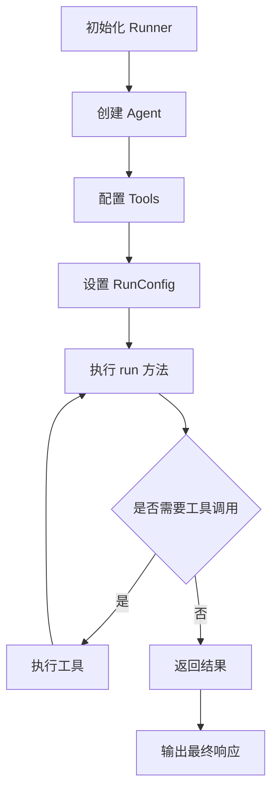

### 基础代码示例

#### 步骤一：导入依赖

```python
from agents import Agent, Runner
from agents.mcp import MCPServer
```

#### 步骤二：创建代理

```python
agent = Agent(
    name="研究助手",
    instructions="你是一个专业的金融分析师，帮助用户研究市场趋势。",
    model="gpt-4o"
)
```

#### 步骤三：执行运行

```python
result = await Runner.run(
    agent,
    input="分析当前科技行业的发展趋势"
)
print(result.final_output)
```

资料来源：[examples/research_bot/README.md:15-25]()

## 示例代码指南

### 沙箱示例

SDK 提供了多种沙箱执行环境的示例，位于 `examples/sandbox/` 目录下。

#### 小型 API 示例

| 示例文件 | 功能说明 | 运行命令 |
|----------|----------|----------|
| `basic.py` | 创建沙箱会话，运行 SandboxAgent，流式输出结果 | `uv run python examples/sandbox/basic.py` |
| `handoffs.py` | 代理之间的交接功能 | `uv run python examples/sandbox/handoffs.py` |
| `sandbox_agent_capabilities.py` | 配置沙箱代理的工作区能力 | `uv run python examples/sandbox/sandbox_agent_capabilities.py` |
| `sandbox_agent_with_tools.py` | 组合沙箱能力与主机定义工具 | `uv run python examples/sandbox/sandbox_agent_with_tools.py` |
| `sandbox_agents_as_tools.py` | 将沙箱代理作为工具暴露给其他代理 | `uv run python examples/sandbox/sandbox_agents_as_tools.py` |

#### 扩展后端示例

扩展示例支持多种后端执行环境：

- **E2B**：提供 bash 风格接口（默认）或 Jupyter 风格接口（`e2b_code_interpreter`）
- **Modal**：支持多种工作区持久化方式（tar、snapshot_filesystem、snapshot_directory）
- **Blaxel**：支持 PTY 驱动的交互式 Python 会话和 Drive 挂载
- **Vercel**：非 PTY 路径，支持命令执行和工作区物化
- **Daytona**：轻量级沙箱执行
- **Runloop**：云端沙箱服务

资料来源：[examples/sandbox/README.md:20-45]()
资料来源：[examples/sandbox/extensions/README.md:1-80]()

### 多代理研究机器人

研究机器人示例展示了多代理协作的工作流程：


运行命令：

```bash
python -m examples.research_bot.main
```

资料来源：[examples/research_bot/README.md:1-35]()

### MCP 示例

#### MCP 工具过滤示例

展示如何：

- 本地运行文件系统 MCP 服务器（通过 `npx`）
- 应用静态工具过滤，暴露特定工具
- 启用强制批准模式测试人机交互路径

运行命令：

```bash
uv run python examples/mcp/tool_filter_example/main.py
```

前置条件：

- `npx` 可用
- `OPENAI_API_KEY` 已配置

#### 流式 HTTP 远程示例

连接 DeepWiki 的 MCP 服务，使用流式 HTTP 传输协议：

```bash
uv run python examples/mcp/streamable_http_remote_example/main.py
```

资料来源：[examples/mcp/tool_filter_example/README.md:1-25]()
资料来源：[examples/mcp/streamable_http_remote_example/README.md:1-20]()

### 模型提供者示例

支持通过适配器层路由模型请求，默认使用 OpenRouter：

```bash
export OPENROUTER_API_KEY="..."
uv run examples/model_providers/any_llm_provider.py
uv run examples/model_providers/any_llm_auto.py
uv run examples/model_providers/litellm_provider.py
uv run examples/model_providers/litellm_auto.py
```

自定义模型：

```bash
uv run examples/model_providers/any_llm_provider.py --model openrouter/openai/gpt-5.4-mini
```

资料来源：[examples/model_providers/README.md:1-25]()

## 医疗支持示例

医疗支持演示工作流展示了复杂的人机协作场景：

### 核心文件结构

| 文件 | 职责 |
|------|------|
| `main.py` | CLI 演示入口 |
| `workflow.py` | 共享工作流执行逻辑、沙箱设置、追踪、批准恢复循环 |
| `support_agents.py` | 定义协调器、福利子代理、沙箱策略代理、记忆摘要代理 |
| `tools.py` | 本地查询工具和批准门控人工交接工具 |
| `skills/prior-auth-packet-builder/SKILL.md` | 运行时加载的沙箱技能 |

### 运行方式

```bash
uv run python examples/sandbox/healthcare_support/main.py --list-scenarios
uv run python examples/sandbox/healthcare_support/main.py --scenario blue_cross_pt_benefits
uv run python examples/sandbox/healthcare_support/main.py --scenario messy_ambiguous_knee_case
uv run python examples/sandbox/healthcare_support/main.py --reset-memory
```

非交互模式运行：

```bash
EXAMPLES_INTERACTIVE_MODE=auto uv run python examples/sandbox/healthcare_support/main.py --scenario messy_ambiguous_knee_case
```

资料来源：[examples/sandbox/healthcare_support/README.md:1-40]()

## 常用配置选项

### RunConfig 配置参数

| 参数 | 类型 | 默认值 | 说明 |
|------|------|--------|------|
| `model` | str | "gpt-4o" | 使用的语言模型 |
| `temperature` | float | 0.7 | 生成温度参数 |
| `max_tokens` | int | None | 最大输出令牌数 |
| `tools` | list | [] | 代理可用工具列表 |
| `tool_override` | list | None | 覆盖默认工具 |
| `tracing_disabled` | bool | False | 是否禁用追踪 |
| `stream_intermediate_steps` | bool | True | 是否流式输出中间步骤 |

### 沙箱配置选项

不同后端支持特定的配置参数：

- **E2B**：`--template`, `--timeout`
- **Modal**：`--workspace-persistence`, `--sandbox-create-timeout-s`
- **Blaxel**：`--image`, `--region`, `--memory`, `--ttl`, `--pause-on-exit`
- **Vercel**：`--runtime`, `--timeout-ms`

资料来源：[examples/sandbox/extensions/README.md:80-120]()

## 最佳实践

### 环境隔离

- 生产环境建议使用沙箱执行代码，避免安全风险
- 使用快照（Snapshot）功能实现工作区持久化
- 为不同任务配置独立的沙箱环境

### 错误处理

SDK 在检测到异常情况时会抛出特定错误类：

| 错误类型 | 触发条件 |
|----------|----------|
| `InvalidManifestPathError` | 清单路径无效（exit_code=111） |
| `WorkspaceArchiveWriteError` | 工作区归档写入失败（exit_code=114） |
| `ExecNonZeroError` | 命令执行返回非零退出码 |

### 调试技巧

1. 启用流式中间步骤输出，监控代理行为
2. 使用 `tracing_disabled=False` 保留追踪记录
3. 结合 Temporal 等工具进行分布式追踪

资料来源：[src/agents/sandbox/session/base_sandbox_session.py:40-80]()

## 下一步

完成快速开始指南后，建议继续探索：

- **高级代理配置**：学习如何构建复杂的多代理系统
- **工具开发**：创建自定义工具扩展代理能力
- **MCP 集成**：连接更多外部服务
- **沙箱高级功能**：深入了解各种沙箱后端的特性和配置
- **生产部署**：了解在生产环境中运行代理的最佳实践

---

<a id='core-concepts'></a>

## 核心概念

### 相关页面

相关主题：[Agent 核心框架](#agent-core), [工具系统](#tools), [Agent 转交机制](#handoffs)

<details>
<summary>相关源码文件</summary>

以下源码文件用于生成本页说明：

- [src/agents/agent.py](https://github.com/openai/openai-agents-python/blob/main/src/agents/agent.py)
- [src/agents/tool.py](https://github.com/openai/openai-agents-python/blob/main/src/agents/tool.py)
- [src/agents/guardrail.py](https://github.com/openai/openai-agents-python/blob/main/src/agents/guardrail.py)
- [src/agents/handoffs/__init__.py](https://github.com/openai/openai-agents-python/blob/main/src/agents/handoffs/__init__.py)
- [src/agents/items.py](https://github.com/openai/openai-agents-python/blob/main/src/agents/items.py)
- [src/agents/result.py](https://github.com/openai/openai-agents-python/blob/main/src/agents/result.py)
</details>

# 核心概念

本文档介绍 openai-agents-python 项目中的核心概念与架构组件。该项目是一个用于构建 AI Agent 系统的 Python 框架，提供了 Agent、Tool、Handoff、Guardrail 等核心抽象，使开发者能够构建复杂的多代理协作应用。

## 1. Agent（代理）

Agent 是整个系统的核心执行单元，代表一个能够接收输入、执行任务并返回结果的 AI 实体。

### 1.1 Agent 的定义与组成

一个 Agent 主要由以下几个部分构成：

| 组件 | 说明 | 资料来源 |
|------|------|---------|
| name | Agent 的唯一标识名称 | src/agents/agent.py |
| instructions | 给 Agent 的系统指令/提示词 | src/agents/agent.py |
| tools | Agent 可调用的工具列表 | src/agents/agent.py |
| handoffs | Agent 可转交到的其他 Agent | src/agents/agent.py |
| input_guardrails | 输入护栏 | src/agents/guardrail.py |
| output_guardrails | 输出护栏 | src/agents/guardrail.py |

### 1.2 Agent 架构图

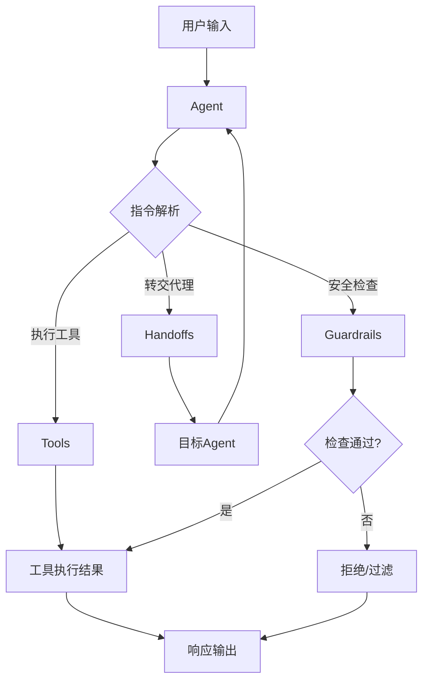

### 1.3 Agent 的核心职责

Agent 在系统中承担以下核心职责：

1. **指令解析**：解析用户输入并理解任务意图
2. **工具调用**：根据任务需要调用适当的工具
3. **代理转交**：在多代理场景下，将任务转交给其他专业 Agent
4. **结果生成**：综合工具执行结果生成最终响应

```python
# Agent 的基本定义结构示例
agent = Agent(
    name="assistant",
    instructions="你是一个有用的助手",
    tools=[search_tool, calculator_tool],
    handoffs=[specialist_agent],
    output_guardrails=[content_filter]
)
```

## 2. Tool（工具）

Tool 是 Agent 与外部世界交互的桥梁，允许 Agent 执行特定的操作如搜索、计算、文件处理等。

### 2.1 Tool 的类型

| 工具类型 | 用途 | 典型应用场景 |
|----------|------|-------------|
| FunctionTool | 封装 Python 函数 | 数据处理、计算 |
| MCPTool | MCP 协议工具 | 与外部服务集成 |
| SandboxedTool | 沙箱环境工具 | 安全执行代码 |

### 2.2 Tool 的定义

```python
# Tool 的基本结构
tool = Tool(
    name="search",
    description="搜索网络信息",
    parameters={...},  # 工具参数定义
    handler=async def search(query): ...
)
```

### 2.3 Tool 执行流程

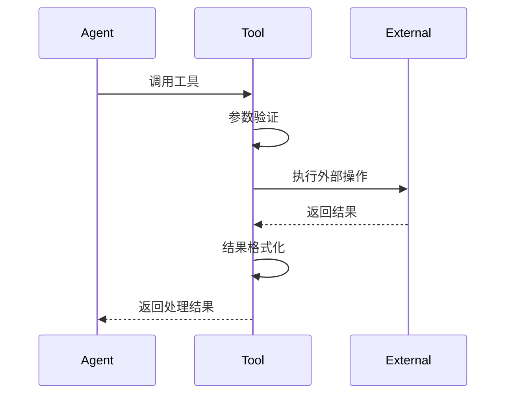

## 3. Handoff（代理转交）

Handoff 是一种在多个 Agent 之间传递对话控制权的机制，是构建多代理系统的关键特性。

### 3.1 Handoff 的工作原理

Handoff 允许一个 Agent 将当前对话上下文转交给另一个 Agent，实现专业分工和任务分解。资料来源：[src/agents/handoffs/__init__.py]()

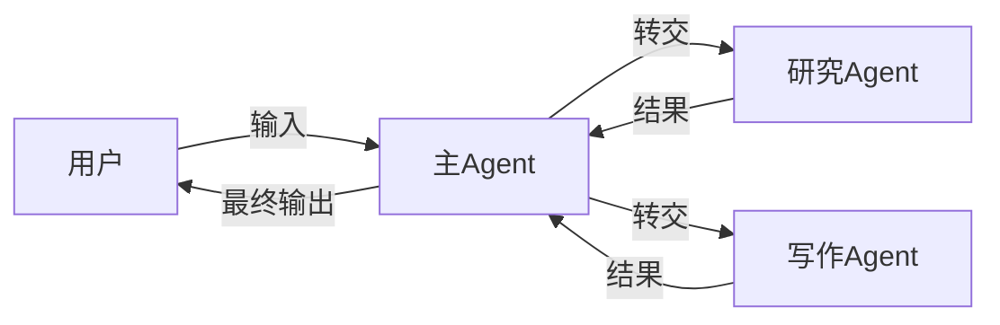

### 3.2 Handoff 的配置选项

| 选项 | 说明 | 必填 |
|------|------|------|
| agent | 目标 Agent 对象 | 是 |
| agent_name | 目标 Agent 名称 | 是 |
| tool_name | 触发转交的调用名 | 否 |
| description | 转交描述 | 否 |
| on_invoke | 转交触发回调 | 否 |

### 3.3 Handoff 与历史记录

系统在转交时会自动处理对话历史，确保新 Agent 能够获取完整的上下文信息：

```python
# Handoff 会自动传递：
# - 原始用户输入
# - 当前对话历史
# - 之前 Agent 的分析结果
# - 工具执行结果
```

## 4. Guardrail（护栏）

Guardrail 是一种安全机制，用于在 Agent 执行过程中对输入和输出进行验证和过滤。

### 4.1 Guardrail 的类型

| 类型 | 作用位置 | 用途 |
|------|----------|------|
| input_guardrail | 工具执行前 | 验证用户输入安全性 |
| output_guardrail | 响应生成后 | 过滤敏感输出内容 |
| tool_input_guardrail | 工具参数传入前 | 验证工具参数 |
| tool_output_guardrail | 工具执行完成后 | 检查工具返回结果 |

### 4.2 Guardrail 执行流程

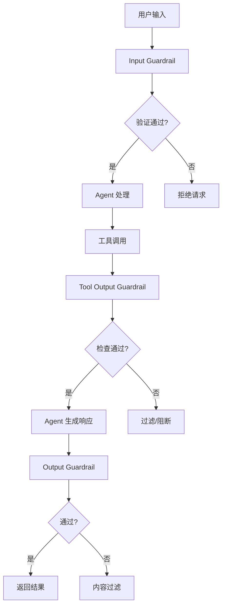

### 4.3 Guardrail 配置示例

```python
# Guardrail 配置结构
guardrail = Guardrail(
    name="content_filter",
    description="过滤不当内容",
    validator=async def check_content(ctx, result): ...
)
```

## 5. Item（消息项）

Item 是对话系统中表示各种消息和事件的标准化数据结构。

### 5.1 Item 的类型

| 类型 | 说明 | 资料来源 |
|------|------|---------|
| MessageOutputItem | 模型生成的消息 | src/agents/items.py |
| ToolCallItem | 工具调用请求 | src/agents/items.py |
| ToolCallOutputItem | 工具执行结果 | src/agents/items.py |
| HandoffItem | 代理转交事件 | src/agents/items.py |
| GuardrailResultItem | 护栏检查结果 | src/agents/items.py |

### 5.2 Item 层次结构

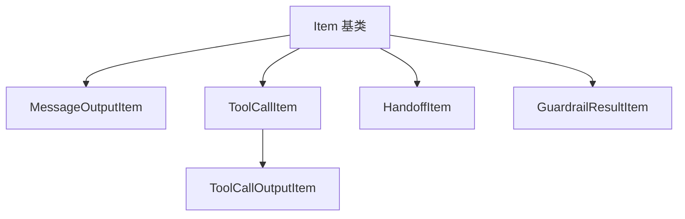

## 6. Result（结果）

Result 是 Agent 执行完成后返回给调用者的数据结构，包含完整的执行信息。

### 6.1 Result 结构

| 字段 | 说明 |
|------|------|
| final_output | 最终输出文本 |
| items | 执行过程中的所有 Item 列表 |
| last_agent | 最后执行的 Agent 信息 |
| raw_responses | 原始模型响应 |
| handoff_history | 转交历史记录 |

### 6.2 Result 生成流程

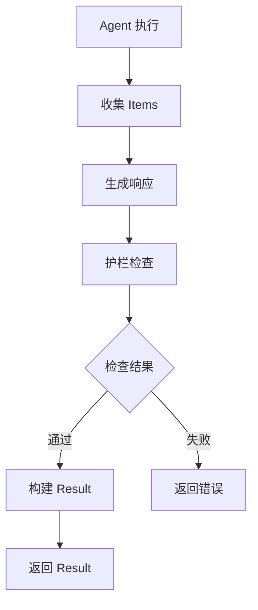

## 7. 核心概念协作关系

### 7.1 完整执行流程

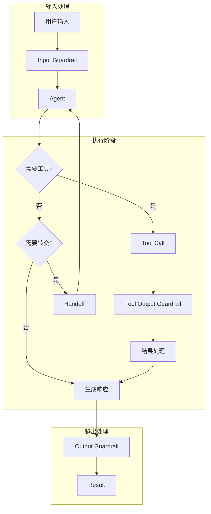

### 7.2 组件交互总结

| 交互关系 | 说明 |
|----------|------|
| Agent → Tool | Agent 调用工具执行具体操作 |
| Agent → Handoff | Agent 将任务转交给其他专业 Agent |
| Tool → Guardrail | 工具执行结果需要通过护栏检查 |
| Handoff → Item | 转交事件记录为 HandoffItem |
| Result → Items | 最终结果汇总所有执行过程中的 Item |

## 8. 最佳实践

### 8.1 Agent 设计原则

1. **单一职责**：每个 Agent 应专注于特定领域
2. **清晰指令**：提供明确、详细的 instructions
3. **适当工具**：只提供任务所需的最小工具集
4. **合理护栏**：根据安全性需求配置适当的护栏

### 8.2 Tool 开发规范

1. **清晰描述**：提供准确的 tool description
2. **参数验证**：实现严格的输入参数验证
3. **错误处理**：优雅处理执行中的异常
4. **结果格式化**：返回结构化的执行结果

### 8.3 Handoff 使用建议

1. **明确转交条件**：在 instructions 中说明何时应该转交
2. **保持上下文**：利用 Handoff 自动传递历史记录的特性
3. **避免循环**：防止 Agent 之间形成死循环转交

## 9. 相关资源

- [Agent 完整文档](../agents/agent.md)
- [Tool 使用指南](../tools/tool.md)
- [Handoff 机制详解](../handoffs/handoff.md)
- [Guardrail 配置参考](../guardrails/guardrail.md)
- [示例代码](../examples/)

---

<a id='agent-core'></a>

## Agent 核心框架

### 相关页面

相关主题：[工具系统](#tools), [Agent 转交机制](#handoffs)

<details>
<summary>相关源码文件</summary>

以下源码文件用于生成本页说明：

- [src/agents/agent.py](https://github.com/openai/openai-agents-python/blob/main/src/agents/agent.py)
- [src/agents/run.py](https://github.com/openai/openai-agents-python/blob/main/src/agents/run.py)
- [src/agents/run_config.py](https://github.com/openai/openai-agents-python/blob/main/src/agents/run_config.py)
- [src/agents/run_context.py](https://github.com/openai/openai-agents-python/blob/main/src/agents/run_context.py)
- [src/agents/run_state.py](https://github.com/openai/openai-agents-python/blob/main/src/agents/run_state.py)
- [src/agents/lifecycle.py](https://github.com/openai/openai-agents-python/blob/main/src/agents/lifecycle.py)
- [src/agents/stream_events.py](https://github.com/openai/openai-agents-python/blob/main/src/agents/stream_events.py)
</details>

# Agent 核心框架

## 概述

Agent 核心框架是 openai-agents-python 项目的核心组成部分，负责管理 AI Agent 的创建、配置、执行和生命周期管理。该框架提供了一套完整的抽象，使开发者能够轻松构建多代理系统，处理任务编排、工具调用、代理间交接（handoff）等复杂场景。

核心框架主要由以下几个模块组成：

| 模块 | 文件路径 | 职责 |
|------|----------|------|
| Agent | `src/agents/agent.py` | 定义代理的行为和配置 |
| Runner | `src/agents/run.py` | 执行代理任务的主入口 |
| RunConfig | `src/agents/run_config.py` | 运行时的配置参数 |
| RunContext | `src/agents/run_context.py` | 执行上下文管理 |
| RunState | `src/agents/run_state.py` | 运行时状态追踪 |
| Lifecycle | `src/agents/lifecycle.py` | 生命周期钩子管理 |
| StreamEvents | `src/agents/stream_events.py` | 事件流式输出 |

资料来源：[src/agents/agent.py:1-50](https://github.com/openai/openai-agents-python/blob/main/src/agents/agent.py)

## 架构图

以下 Mermaid 图展示了 Agent 核心框架的整体架构：

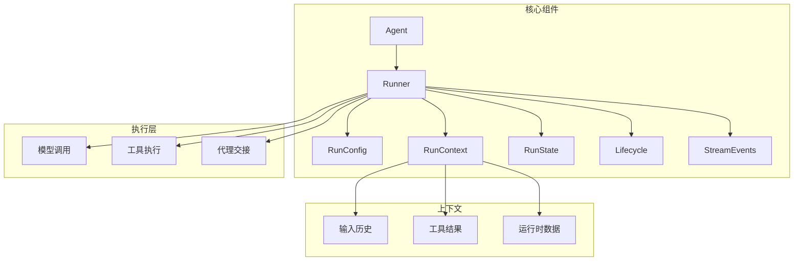

## Agent 类

### 类的定义与核心属性

`Agent` 类是框架的核心抽象，封装了代理的名称、模型配置、指令、工具集等关键属性。

```python
class Agent:
    def __init__(
        self,
        name: str,
        instructions: str | Callable | None = None,
        model: str | Model = "gpt-4o",
        tools: list[Tool] | None = None,
        handoffs: list[Handoff | Agent] | None = None,
        input_guardrails: list[InputGuardrail] | None = None,
        output_guardrails: list[OutputGuardrail] | None = None,
        tool_validator: ToolValidator | None = None,
        response_format: type[BaseModel] | None = None,
    )
```

**核心属性说明：**

| 属性 | 类型 | 说明 |
|------|------|------|
| `name` | `str` | 代理的唯一标识名称 |
| `instructions` | `str \| Callable \| None` | 代理的系统指令 |
| `model` | `str \| Model` | 使用的模型名称或对象 |
| `tools` | `list[Tool] \| None` | 代理可用的工具列表 |
| `handoffs` | `list[Handoff \| Agent] \| None` | 可交接给其他代理的配置 |
| `input_guardrails` | `list[InputGuardrail] \| None` | 输入验证器 |
| `output_guardrails` | `list[OutputGuardrail] \| None` | 输出验证器 |

资料来源：[src/agents/agent.py:50-100](https://github.com/openai/openai-agents-python/blob/main/src/agents/agent.py)

### 代理指令处理

代理的 `instructions` 属性支持多种形式：

1. **静态字符串**：直接提供系统提示
2. **可调用函数**：动态生成指令，支持根据上下文信息生成个性化指令
3. **None**：使用默认指令

```python
# 静态字符串示例
agent = Agent(name="分析师", instructions="你是一个专业的数据分析师")

# 动态指令示例
def dynamic_instructions(ctx: RunContextWrapper, agent: Agent) -> str:
    user_preference = ctx.get("user_preference", "默认")
    return f"用户偏好：{user_preference}"

agent = Agent(name="个性化助手", instructions=dynamic_instructions)
```

资料来源：[src/agents/agent.py:100-150](https://github.com/openai/openai-agents-python/blob/main/src/agents/agent.py)

## Runner 执行器

### Runner 概述

`Runner` 是执行代理任务的主入口类，负责协调整个执行流程。

```python
class Runner:
    @staticmethod
    async def run(
        agent: Agent,
        input: str | list[Message] | list[ToolResult],
        *,
        context: dict[str, Any] | None = None,
        max_steps: int = 150,
        config: RunConfig | None = None,
    ) -> FinalOutput
```

### 异步执行流程

```mermaid
sequenceDiagram
    participant 用户
    participant Runner
    participant Agent
    participant 工具
    participant 模型
    
    用户->>Runner: run(agent, input)
    Runner->>RunContext: 创建上下文
    Runner->>Agent: 执行指令
    Agent->>模型: 生成响应
    循环 while 需要工具调用
        模型->>工具: 调用工具
        工具-->>模型: 返回结果
    end
    模型-->>Runner: 最终输出
    Runner-->>用户: FinalOutput
```

### 核心执行方法

Runner 提供了多个静态方法用于不同场景：

| 方法 | 说明 | 使用场景 |
|------|------|----------|
| `run()` | 标准异步执行 | 大多数场景 |
| `run_single_agent()` | 单代理快速执行 | 简单任务 |
| `run_concurrently()` | 并发执行多个代理 | 批量处理 |
| `run_stream_events()` | 流式事件输出 | 实时展示 |

资料来源：[src/agents/run.py:50-200](https://github.com/openai/openai-agents-python/blob/main/src/agents/run.py)

## RunConfig 配置

### 配置参数详解

`RunConfig` 类封装了运行时的所有配置选项：

```python
class RunConfig(BaseModel):
    model: str = "gpt-4o"
    model_provider: str = "openai"
    max_tokens: int | None = 16384
    temperature: float = 1.0
    top_p: float | None = None
    stop: str | list[str] | None = None
    stream: bool = False
    stream_intermediate_steps: bool = False
    parallel_tool_calls: bool = True
    max_parallel_tool_calls: int | None = None
    tracing: TracingExportType | TracingDisabledReason | None = None
```

**配置参数说明：**

| 参数 | 类型 | 默认值 | 说明 |
|------|------|--------|------|
| `model` | `str` | `"gpt-4o"` | 模型名称 |
| `model_provider` | `str` | `"openai"` | 模型提供商 |
| `max_tokens` | `int \| None` | `16384` | 最大输出 token 数 |
| `temperature` | `float` | `1.0` | 采样温度 |
| `top_p` | `float \| None` | `None` | Nucleus 采样参数 |
| `stop` | `str \| list[str]` | `None` | 停止序列 |
| `stream` | `bool` | `False` | 是否启用流式输出 |
| `parallel_tool_calls` | `bool` | `True` | 是否并行执行工具调用 |
| `max_parallel_tool_calls` | `int \| None` | `None` | 最大并行工具调用数 |
| `tracing` | `TracingExportType \| None` | `None` | 追踪导出配置 |

资料来源：[src/agents/run_config.py:30-100](https://github.com/openai/openai-agents-python/blob/main/src/agents/run_config.py)

### 模型提供商配置

框架支持多种模型提供商，通过 `model_provider` 参数指定：

```python
# OpenAI
config = RunConfig(model_provider="openai", model="gpt-4o")

# Anthropic
config = RunConfig(model_provider="anthropic", model="claude-3-opus-20240229")

# Azure OpenAI
config = RunConfig(model_provider="azure", model="gpt-4o")

# 自定义提供商
config = RunConfig(model_provider="my-provider", model="custom-model")
```

## RunContext 上下文管理

### 上下文的作用

`RunContext` 负责管理代理执行过程中的上下文信息，包括输入历史、工具调用结果、运行时数据等。

```python
class RunContextWrapper(Generic[AgentStateT]):
    def __init__(
        self,
        trace_id: str,
        session_id: str,
        agent: Agent,
        messages: list[ChatMessage],
        state: AgentStateT,
        current_agent: Agent,
        agent_history: dict[str, list[ChatMessage]],
        pending_handoffs: list[Handoff],
        tools: list[Tool],
        turn_context: TurnContext | None,
    )
```

### 上下文数据访问

| 方法 | 说明 |
|------|------|
| `get(key)` | 获取上下文中的值 |
| `set(key, value)` | 设置上下文中的值 |
| `get_messages()` | 获取消息历史 |
| `get_state()` | 获取代理状态 |
| `update_state(**kwargs)` | 更新代理状态 |

资料来源：[src/agents/run_context.py:30-80](https://github.com/openai/openai-agents-python/blob/main/src/agents/run_context.py)

### 上下文数据流

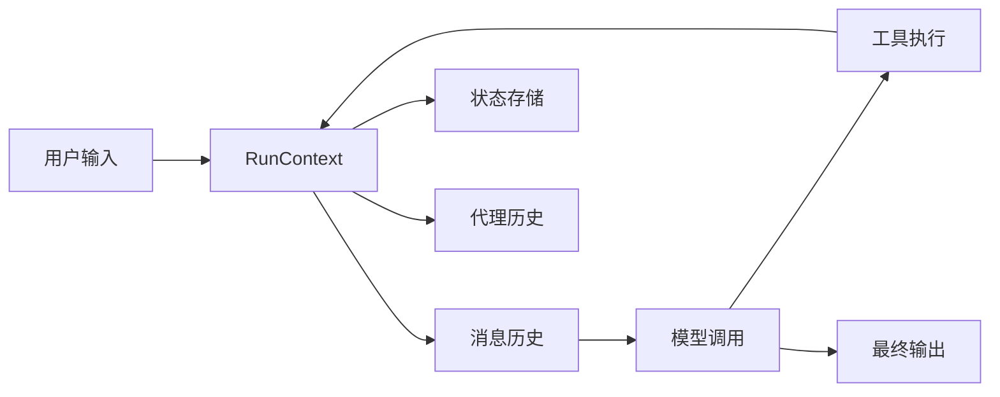

## RunState 状态管理

### 状态追踪

`RunState` 负责追踪代理执行过程中的所有状态信息：

```python
class RunState(BaseModel):
    run_id: str
    turn_count: int = 0
    step_count: int = 0
    messages: list[ChatMessage] = Field(default_factory=list)
    tool_results: list[ToolResult] = Field(default_factory=list)
    agent_history: dict[str, list[ChatMessage]] = Field(default_factory=dict)
    pending_handoffs: list[Handoff] = Field(default_factory=list)
    output_guardrail_results: list[GuardrailResult] = Field(default_factory=list)
    input_guardrail_results: list[GuardrailResult] = Field(default_factory=list)
```

### 状态字段说明

| 字段 | 类型 | 说明 |
|------|------|------|
| `run_id` | `str` | 唯一运行标识符 |
| `turn_count` | `int` | 代理轮次计数 |
| `step_count` | `int` | 执行步骤计数 |
| `messages` | `list[ChatMessage]` | 完整消息历史 |
| `tool_results` | `list[ToolResult]` | 工具执行结果 |
| `agent_history` | `dict[str, list[ChatMessage]]` | 各代理的消息历史 |
| `pending_handoffs` | `list[Handoff]` | 待处理的交接请求 |
| `output_guardrail_results` | `list[GuardrailResult]` | 输出验证结果 |
| `input_guardrail_results` | `list[GuardrailResult]` | 输入验证结果 |

资料来源：[src/agents/run_state.py:20-60](https://github.com/openai/openai-agents-python/blob/main/src/agents/run_state.py)

## Lifecycle 生命周期钩子

### 钩子类型

框架提供了完整的生命周期钩子系统，允许开发者在代理执行的各个阶段注入自定义逻辑：

```python
class Hooks(Generic[AgentStateT]):
    async def on_agent_start(
        self,
        context_wrapper: RunContextWrapper[AgentStateT],
        agent: Agent,
    ) -> None
    
    async def on_agent_end(
        self,
        context_wrapper: RunContextWrapper[AgentStateT],
        agent: Agent,
        output: str,
    ) -> None
    
    async def on_tool_start(
        self,
        context_wrapper: RunContextWrapper[AgentStateT],
        tool: Tool,
        parameters: dict[str, Any],
    ) -> None
    
    async def on_tool_end(
        self,
        context_wrapper: RunContextWrapper[AgentStateT],
        tool: Tool,
        result: Any,
    ) -> None
```

### 钩子执行流程

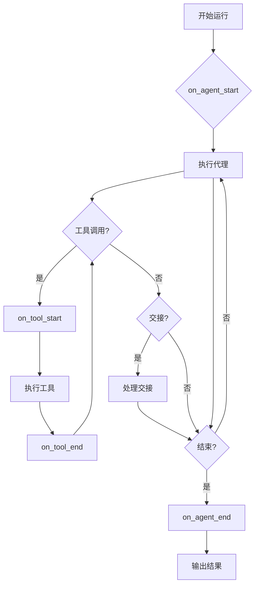

### 可用钩子列表

| 钩子名称 | 触发时机 | 用途示例 |
|----------|----------|----------|
| `on_agent_start` | 代理开始执行前 | 记录开始时间、初始化资源 |
| `on_agent_end` | 代理执行完成后 | 记录结束时间、清理资源 |
| `on_tool_start` | 工具开始执行前 | 记录工具调用、参数验证 |
| `on_tool_end` | 工具执行完成后 | 记录工具结果、错误处理 |
| `on_handoff` | 代理交接时 | 传递上下文、更新状态 |
| `on_exception` | 异常发生时 | 错误日志、告警通知 |

资料来源：[src/agents/lifecycle.py:30-150](https://github.com/openai/openai-agents-python/blob/main/src/agents/lifecycle.py)

## StreamEvents 事件流

### 事件类型

`StreamEvents` 定义了所有可流式输出的事件类型：

```python
class StreamEvents:
    AGENT_DETAIL_STREAMING = "agent_detail_streaming"
    RUN_ITEM_STOPPED = "run_item_stopped"
    RUN_ITEM_DELTA = "run_item_delta"
    RUN_ITEM_ADDED = "run_item_added"
    TEXT_DONE = "text_done"
    TEXT_DELTA = "text_delta"
    IMAGE_DETAIL_DONE = "image_detail_done"
    ABORTED_ERROR = "aborted_error"
    CONNECTION_ERROR = "connection_error"
    ERROR = "error"
    TOOL_CALL = "tool_call"
    TOOL_CALL_DETAILS = "tool_call_details"
    HANDOVER = "handover"
    PAUSED = "paused"
    RESUMED = "resumed"
```

### 事件数据结构

| 事件类型 | 数据结构 | 说明 |
|----------|----------|------|
| `RUN_ITEM_DELTA` | `RunItemDeltaEvent` | 运行项的增量更新 |
| `RUN_ITEM_ADDED` | `RunItemAddedEvent` | 新增运行项 |
| `TEXT_DELTA` | `TextDeltaEvent` | 文本增量 |
| `TOOL_CALL` | `ToolCallEvent` | 工具调用事件 |
| `HANDOVER` | `HandoverEvent` | 代理交接事件 |

资料来源：[src/agents/stream_events.py:20-100](https://github.com/openai/openai-agents-python/blob/main/src/agents/stream_events.py)

### 流式使用示例

```python
async def run_with_stream():
    config = RunConfig(stream=True, stream_intermediate_steps=True)
    
    events = Runner.run_stream_events(
        agent=my_agent,
        input="用户问题",
        config=config
    )
    
    async for event in events:
        if event.type == StreamEvents.TEXT_DELTA:
            print(event.data.text, end="", flush=True)
        elif event.type == StreamEvents.TOOL_CALL:
            print(f"\n调用工具: {event.data.name}")
```

## 执行流程详解

### 完整执行流程图

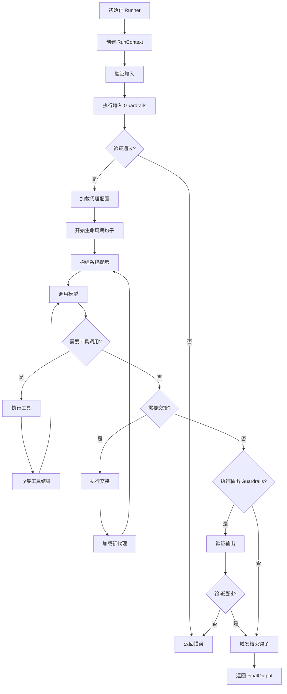

### Turn Resolution 机制

Turn resolution 是框架处理多轮对话和状态更新的核心机制，位于 `src/agents/run_internal/turn_resolution.py`：

```python
async def _resolve_turn(
    public_agent: Agent,
    original_input: str | list[Message] | list[ToolResult],
    pre_step_items: list[RunItem],
    new_step_items: list[RunItem],
    function_results: list[ToolResult],
    # ... 其他参数
) -> TurnResult:
```

该机制负责：
1. 处理工具调用结果
2. 管理消息历史
3. 处理代理交接
4. 生成最终输出

资料来源：[src/agents/run_internal/turn_resolution.py:50-150](https://github.com/openai/openai-agents-python/blob/main/src/agents/run_internal/turn_resolution.py)

## 代理交接 (Handoffs)

### 交接机制

代理交接允许一个代理将控制权传递给另一个代理，同时传递必要的上下文信息：

```python
handoff = Handoff(
    agent=target_agent,
    tool_name="transfer_to_target",
    tool_description="切换到目标代理",
    metadata={"reason": "需要专门知识"}
)

source_agent = Agent(
    name="路由器",
    handoffs=[handoff]
)
```

### 交接数据传递

交接时传递的数据结构：

| 字段 | 说明 |
|------|------|
| `agent_name` | 目标代理名称 |
| `handoff_config` | 交接配置 |
| `input_items` | 传递给目标代理的输入项 |
| `history_items` | 完整的对话历史 |
| `metadata` | 附加元数据 |

资料来源：[src/agents/handoffs/history.py:30-80](https://github.com/openai/openai-agents-python/blob/main/src/agents/handoffs/history.py)

## Guardrails 防护机制

### 输入防护

输入防护在模型调用前验证用户输入：

```python
class InputGuardrail:
    async def check(
        self,
        context: RunContextWrapper,
        agent: Agent,
        input: str | list[Message],
    ) -> GuardrailResult:
        # 自定义验证逻辑
        pass
```

### 输出防护

输出防护在模型生成后验证输出：

```python
class OutputGuardrail:
    async def check(
        self,
        context: RunContextWrapper,
        agent: Agent,
        output: str | BaseModel,
    ) -> GuardrailResult:
        # 自定义验证逻辑
        pass
```

### 防护结果

```python
class GuardrailResult(BaseModel):
    pass_result: bool
    tripwire_triggered: bool = False
    data: Any = None
    message: str | None = None
```

| 结果字段 | 说明 |
|----------|------|
| `pass_result` | 验证是否通过 |
| `tripwire_triggered` | 是否触发安全开关 |
| `data` | 验证返回的数据 |
| `message` | 验证消息 |

## 最佳实践

### 1. 合理设置 Max Steps

```python
# 简单任务
config = RunConfig(max_steps=10)

# 复杂多步骤任务
config = RunConfig(max_steps=150)
```

### 2. 使用生命周期钩子进行监控

```python
class MyHooks(Hooks):
    async def on_agent_start(self, context, agent):
        logger.info(f"开始执行代理: {agent.name}")
    
    async def on_tool_end(self, context, tool, result):
        logger.info(f"工具 {tool.name} 执行完成")
```

### 3. 流式输出的正确使用

```python
async for event in Runner.run_stream_events(agent, input, config=config):
    if event.type == StreamEvents.TEXT_DELTA:
        # 增量处理文本
        accumulated_text += event.data.text
```

## 总结

Agent 核心框架提供了一套完整、模块化的代理系统架构：

- **Agent** 负责代理的行为定义
- **Runner** 协调整个执行流程
- **RunConfig** 管理运行时配置
- **RunContext** 维护执行上下文
- **RunState** 追踪运行时状态
- **Lifecycle** 提供生命周期钩子扩展
- **StreamEvents** 支持事件流式输出

这些组件协同工作，使开发者能够灵活构建复杂的 AI Agent 应用，同时保持代码的可维护性和可扩展性。

---

<a id='tools'></a>

## 工具系统

### 相关页面

相关主题：[MCP 协议集成](#mcp), [Agent 核心框架](#agent-core)

<details>
<summary>相关源码文件</summary>

以下源码文件用于生成本页说明：

- [src/agents/tool.py](https://github.com/openai/openai-agents-python/blob/main/src/agents/tool.py)
- [src/agents/function_schema.py](https://github.com/openai/openai-agents-python/blob/main/src/agents/function_schema.py)
- [src/agents/tool_context.py](https://github.com/openai/openai-agents-python/blob/main/src/agents/tool_context.py)
- [src/agents/tool_guardrails.py](https://github.com/openai/openai-agents-python/blob/main/src/agents/tool_guardrails.py)
- [examples/basic/tools.py](https://github.com/openai/openai-agents-python/blob/main/examples/basic/tools.py)
- [examples/tools/shell.py](https://github.com/openai/openai-agents-python/blob/main/examples/tools/shell.py)
- [examples/tools/code_interpreter.py](https://github.com/openai/openai-agents-python/blob/main/examples/tools/code_interpreter.py)
</details>

# 工具系统

## 概述

工具系统（Tool System）是 openai-agents-python 框架的核心组件之一，它为 AI Agent 提供了与外部世界交互的能力。通过工具系统，Agent 可以执行代码、搜索网络、操作文件系统、调用外部 API 等。工具在 Agent 执行循环中扮演着关键角色，使语言模型能够执行实际操作而不仅仅是生成文本响应。

工具系统的设计遵循以下核心原则：

- **声明式配置**：工具通过 Pydantic 模型进行类型安全的声明式配置
- **上下文感知**：工具可以访问运行时上下文信息，包括对话历史和中间结果
- **安全隔离**：通过沙箱（Sandbox）机制执行危险操作，保护主机系统安全
- **可扩展架构**：支持自定义工具、MCP 服务器集成以及第三方扩展

资料来源：[src/agents/tool.py]()

## 架构设计

### 整体架构

工具系统的架构采用分层设计，主要包含以下几个层次：

```
┌─────────────────────────────────────────────────────────┐
│                    Agent Layer                           │
│              (Agent, SandboxAgent, etc.)                 │
└─────────────────────────────────────────────────────────┘
                            │
                            ▼
┌─────────────────────────────────────────────────────────┐
│                   Tool Layer                             │
│    ┌─────────────┬──────────────┬──────────────────┐   │
│    │  FunctionTool│ MCPTool     │  Custom Tools    │   │
│    └─────────────┴──────────────┴──────────────────┘   │
└─────────────────────────────────────────────────────────┘
                            │
                            ▼
┌─────────────────────────────────────────────────────────┐
│               Execution Layer                            │
│    ┌─────────────┬──────────────┬──────────────────┐   │
│    │  Sandbox    │ Local Exec   │  Remote Service │   │
│    └─────────────┴──────────────┴──────────────────┘   │
└─────────────────────────────────────────────────────────┘
```

### 核心组件关系

工具系统由多个核心组件构成，它们之间通过清晰的接口进行交互：

| 组件 | 职责 | 源码位置 |
|------|------|----------|
| `Tool` | 工具基类，定义工具的通用接口和元数据 | `src/agents/tool.py` |
| `FunctionTool` | 函数工具，将 Python 函数包装为 Agent 可调用的工具 | `src/agents/tool.py` |
| `ToolContext` | 工具执行上下文，提供运行时信息和状态管理 | `src/agents/tool_context.py` |
| `FunctionSchema` | 函数模式生成器，从 Python 函数生成 OpenAI 兼容的模式 | `src/agents/function_schema.py` |
| `ToolGuardrails` | 工具护栏，对工具输入输出进行安全校验 | `src/agents/tool_guardrails.py` |
| `MCPTool` | MCP 协议工具，集成 Model Context Protocol 服务器 | `src/agents/mcp/server.py` |

资料来源：[src/agents/tool.py:1-50]()

## 工具类型

### FunctionTool

`FunctionTool` 是最常用的工具类型，它将 Python 函数包装为 Agent 可调用的工具。FunctionTool 自动处理参数解析、类型转换和结果序列化。

```python
# 典型的 FunctionTool 使用方式
from agents import FunctionTool

def add_numbers(a: int, b: int) -> int:
    """将两个数字相加"""
    return a + b

tool = FunctionTool.from_function(add_numbers)
```

FunctionTool 支持的功能包括：

- **自动模式生成**：从函数签名和文档字符串生成 OpenAI 函数调用模式
- **类型验证**：使用 Pydantic 进行参数和返回值的类型验证
- **描述覆盖**：允许通过参数覆盖自动生成的描述信息
- **输入过滤器**：支持对输入参数进行预处理
- **输出格式化**：支持对返回结果进行后处理

资料来源：[src/agents/tool.py:50-150]()

### MCPTool

MCPTool 提供了对 Model Context Protocol（MCP）服务器的支持，使 Agent 能够调用通过 MCP 协议暴露的工具。MCP 是一种标准化的工具发现和调用协议。

```python
from agents import MCPTool

# 从 MCP 服务器创建工具
mcp_tool = MCPTool.from_server(
    name="filesystem",
    command="npx",
    args=["-y", "@modelcontextprotocol/server-filesystem", "/path/to/dir"]
)
```

MCPTool 支持的特性：

- **资源模板**：MCP 服务器可以暴露资源模板供 Agent 使用
- **资源读取**：支持读取 MCP 服务器暴露的资源内容
- **工具发现**：自动发现并暴露 MCP 服务器提供的所有工具
- **需求审批**：支持对特定工具配置需要人工审批的策略

资料来源：[src/agents/mcp/server.py:1-80]()

### SandboxAgent 内置工具

SandboxAgent 提供了一组内置工具，专门用于在隔离环境中执行操作：

| 工具名称 | 功能 | 源码位置 |
|----------|------|----------|
| `read_file` | 读取文件内容 | Sandbox 实现 |
| `write_file` | 写入文件内容 | Sandbox 实现 |
| `list_directory` | 列出目录内容 | Sandbox 实现 |
| `run_terminal_command` | 执行终端命令 | Sandbox 实现 |

资料来源：[examples/sandbox/basic.py]()

## 函数模式

### 模式生成机制

`FunctionSchema` 类负责从 Python 函数生成 OpenAI 兼容的函数模式。这个过程包括：

1. **函数签名分析**：使用 `inspect` 模块分析函数参数和类型注解
2. **文档解析**：提取 docstring 中的描述信息
3. **默认值处理**：处理可选参数和默认值
4. **Pydantic 模型转换**：将复杂类型转换为 JSON Schema

```python
# FunctionSchema 生成的结果示例
{
    "type": "function",
    "function": {
        "name": "search_web",
        "description": "搜索网络获取信息",
        "parameters": {
            "type": "object",
            "properties": {
                "query": {
                    "type": "string",
                    "description": "搜索查询词"
                }
            },
            "required": ["query"]
        }
    }
}
```

资料来源：[src/agents/function_schema.py:1-60]()

### 工具描述优化

系统支持对自动生成的工具描述进行优化和覆盖，确保模型能够准确理解工具的用途：

```python
tool = FunctionTool.from_function(
    my_function,
    name_override="custom_tool_name",
    description_override="自定义工具描述",
    parameters_override={"query": {"description": "优化后的描述"}}
)
```

资料来源：[src/agents/tool.py:150-200]()

## 工具上下文

### 上下文结构

`ToolContext` 为工具执行提供了完整的上下文信息，使工具能够访问运行时状态：

```python
@dataclass
class ToolContext:
    run_context: RunContextWrapper[Any]      # 运行上下文
    tool_name: str                           # 当前工具名称
    tool_call_id: str                        # 工具调用 ID
    input_json: str                          # 输入参数 JSON
    current_agent: Agent                     # 当前 Agent
    round_manager: RoundManager             # 轮次管理器
```

工具上下文提供的能力：

- **对话历史访问**：通过 `run_context.messages` 访问完整的对话历史
- **中间结果引用**：访问同一轮次中其他工具的执行结果
- **状态管理**：在多次工具调用之间保持状态
- **Agent 信息**：获取当前执行 Agent 的详细信息

资料来源：[src/agents/tool_context.py:1-50]()

### 输入过滤机制

工具支持通过 `input_filter` 对输入进行预处理：

```python
def filter_input(input_json: str, context: ToolContext) -> str:
    # 自定义输入过滤逻辑
    data = json.loads(input_json)
    data["filtered_param"] = "modified_value"
    return json.dumps(data)

tool = FunctionTool.from_function(
    my_function,
    input_filter=filter_input
)
```

资料来源：[src/agents/tool.py:200-250]()

## 工具护栏

### 护栏机制

`ToolGuardrails` 提供了对工具调用的安全检查机制，分为输入护栏和输出护栏两类：

```python
@dataclass
class ToolGuardrail:
    name: str
    check: Callable[[RunContextWrapper, Tool, str], Awaitable[GuardrailFunctionOutput]]
    config: dict[str, Any] = field(default_factory=dict)
```

### 输入护栏

输入护栏在工具执行前对参数进行检查：

```python
async def validate_input(
    context: RunContextWrapper,
    tool: Tool,
    input_json: str
) -> GuardrailFunctionOutput:
    # 检查输入参数是否符合预期
    data = json.loads(input_json)
    if "sensitive_field" in data:
        return GuardrailFunctionOutput(
            pass_percentage=0.0,  # 阻止执行
            action_info=ActionInfo(
                action_type=ActionType.INPUT_CORRECTION,
                message="检测到敏感数据"
            )
        )
    return GuardrailFunctionOutput(pass_percentage=1.0)
```

### 输出护栏

输出护栏在工具执行后对结果进行检查：

```python
async def validate_output(
    context: RunContextWrapper,
    tool: Tool,
    output: str
) -> GuardrailFunctionOutput:
    # 检查输出内容
    if contains_sensitive_data(output):
        return GuardrailFunctionOutput(
            pass_percentage=0.0,
            action_info=ActionInfo(
                action_type=ActionType.OUTPUT_FILTER,
                message="输出包含敏感信息"
            )
        )
    return GuardrailFunctionOutput(pass_percentage=1.0)
```

资料来源：[src/agents/tool_guardrails.py:1-100]()

## 使用示例

### 基础工具创建

```python
# examples/basic/tools.py
from agents import FunctionTool

def get_weather(location: str, unit: str = "celsius") -> str:
    """获取指定位置的天气信息
    
    Args:
        location: 城市名称
        unit: 温度单位 (celsius 或 fahrenheit)
    """
    # 实际实现中会调用天气 API
    return f"{location} 当前温度为 22°C"

weather_tool = FunctionTool.from_function(
    get_weather,
    name_override="get_weather",
    description_override="获取指定城市的天气信息"
)
```

资料来源：[examples/basic/tools.py:1-30]()

### Shell 工具

```python
# examples/tools/shell.py
from agents import FunctionTool
import subprocess

def execute_shell(command: str, timeout: int = 30) -> str:
    """在终端执行 shell 命令
    
    Args:
        command: 要执行的命令
        timeout: 超时时间（秒）
    """
    try:
        result = subprocess.run(
            command,
            shell=True,
            capture_output=True,
            text=True,
            timeout=timeout
        )
        return result.stdout if result.returncode == 0 else f"Error: {result.stderr}"
    except subprocess.TimeoutExpired:
        return "命令执行超时"
```

资料来源：[examples/tools/shell.py:1-30]()

### 代码解释器工具

```python
# examples/tools/code_interpreter.py
from agents import FunctionTool
import contextlib
import io

def run_python(code: str) -> str:
    """执行 Python 代码
    
    Args:
        code: 要执行的 Python 代码
    """
    stdout = io.StringIO()
    stderr = io.StringIO()
    
    with contextlib.redirect_stdout(stdout), contextlib.redirect_stderr(stderr):
        try:
            exec(code, {})
            output = stdout.getvalue()
            return output if output else "代码执行完成，无输出"
        except Exception as e:
            return f"执行错误: {str(e)}"
```

资料来源：[examples/tools/code_interpreter.py:1-30]()

## 工具与 Agent 的集成

### Agent 工具配置

Agent 在初始化时通过 `tools` 参数接收工具列表：

```python
from agents import Agent

agent = Agent(
    name="research_assistant",
    instructions="你是一个研究助手，可以使用工具来完成任务",
    tools=[
        web_search_tool,
        file_read_tool,
        code_interpreter_tool
    ]
)
```

### 工具可视化

工具系统提供了可视化功能，可以生成 Agent 和工具的关系图：

```python
from agents.extensions.visualization import get_all_nodes, get_all_edges

# 生成 DOT 格式的图描述
nodes = get_all_nodes(agent)
edges = get_all_edges(agent)
dot_graph = f"digraph {{\n{nodes}\n{edges}\n}}"
```

资料来源：[src/agents/extensions/visualization.py:1-80]()

## 执行流程

### 工具调用生命周期

```
┌──────────────────────────────────────────────────────────┐
│                    工具调用流程                            │
└──────────────────────────────────────────────────────────┘
                            │
                            ▼
┌─────────────────────────────────────────────────────────┐
│ 1. 工具选择                                              │
│    - 模型根据工具描述选择合适的工具                        │
│    - 生成工具调用参数                                     │
└─────────────────────────────────────────────────────────┘
                            │
                            ▼
┌─────────────────────────────────────────────────────────┐
│ 2. 输入护栏检查                                          │
│    - 验证参数类型和格式                                   │
│    - 安全检查（可选）                                     │
└─────────────────────────────────────────────────────────┘
                            │
                            ▼
┌─────────────────────────────────────────────────────────┐
│ 3. 工具执行                                              │
│    - 调用实际的工具函数                                   │
│    - 处理异常情况                                        │
└─────────────────────────────────────────────────────────┘
                            │
                            ▼
┌─────────────────────────────────────────────────────────┐
│ 4. 输出护栏检查                                          │
│    - 验证返回结果                                        │
│    - 内容过滤（可选）                                     │
└─────────────────────────────────────────────────────────┘
                            │
                            ▼
┌─────────────────────────────────────────────────────────┐
│ 5. 结果返回                                              │
│    - 将结果传递给模型                                    │
│    - 继续执行循环                                        │
└─────────────────────────────────────────────────────────┘
```

## 配置选项

### 工具级别配置

| 选项 | 类型 | 默认值 | 说明 |
|------|------|--------|------|
| `name` | `str` | 函数名 | 工具在模型调用时的名称 |
| `description` | `str` | docstring | 工具的功能描述 |
| `parameters_override` | `dict` | `None` | 参数模式的覆盖配置 |
| `input_filter` | `Callable` | `None` | 输入预处理函数 |
| `output_formatter` | `Callable` | `None` | 输出格式化函数 |
| `require_approval` | `bool` | `False` | 是否需要人工审批 |

### Agent 工具配置

| 选项 | 类型 | 说明 |
|------|------|------|
| `tools` | `list[Tool]` | 分配给 Agent 的工具列表 |
| `tool_choice` | `str \| None` | 强制模型使用特定工具 |
| `parallel_tool_calls` | `bool` | 是否允许并行工具调用 |

## 最佳实践

### 工具命名规范

- 使用清晰、简洁的英文名称
- 采用 snake_case 命名法
- 名称应该反映工具的核心功能

### 描述撰写建议

- 第一行应该是简短的总结性描述
- 详细说明参数含义和预期格式
- 提供使用示例（如果适用）
- 明确标注必选和可选参数

### 错误处理

- 返回有意义的错误信息
- 区分不同类型的错误
- 避免暴露敏感的系统信息

### 安全考虑

- 对敏感操作配置人工审批
- 使用输入护栏验证参数
- 使用输出护栏过滤敏感数据
- 在沙箱环境中执行危险操作

## 相关资源

- 源码：[src/agents/tool.py]()
- 函数模式：[src/agents/function_schema.py]()
- 工具上下文：[src/agents/tool_context.py]()
- 工具护栏：[src/agents/tool_guardrails.py]()
- MCP 支持：[src/agents/mcp/server.py]()
- 示例：[examples/basic/tools.py]()

---

<a id='mcp'></a>

## MCP 协议集成

### 相关页面

相关主题：[工具系统](#tools), [Agent 核心框架](#agent-core)

<details>
<summary>相关源码文件</summary>

以下源码文件用于生成本页说明：

- [src/agents/mcp/manager.py](https://github.com/openai/openai-agents-python/blob/main/src/agents/mcp/manager.py)
- [src/agents/mcp/server.py](https://github.com/openai/openai-agents-python/blob/main/src/agents/mcp/server.py)
- [src/agents/mcp/util.py](https://github.com/openai/openai-agents-python/blob/main/src/agents/mcp/util.py)
- [src/agents/_mcp_tool_metadata.py](https://github.com/openai/openai-agents-python/blob/main/src/agents/_mcp_tool_metadata.py)
- [examples/mcp](https://github.com/openai/openai-agents-python/blob/main/examples/mcp)
</details>

# MCP 协议集成

## 概述

MCP（Model Context Protocol）协议集成是 openai-agents-python 框架的核心功能之一，它允许 AI Agent 与外部 MCP 服务器建立连接，并调用服务器提供的各种工具和资源。通过 MCP 集成，开发者可以扩展 Agent 的能力边界，使其能够访问文件系统、数据库、Web 服务等外部系统。

本框架提供了完整的 MCP 客户端实现，支持本地 MCP 服务器和远程 MCP 服务器两种连接方式，并提供了工具过滤、审批流程等企业级功能。

## 核心组件

### MCPManager

`MCPManager` 是 MCP 集成的核心管理类，负责维护与 MCP 服务器的连接状态和交互逻辑。

| 属性 | 类型 | 说明 |
|------|------|------|
| `servers` | `dict[str, MCPServer]` | 已注册的 MCP 服务器映射表 |
| `tools` | `list[MCPTool]` | 从所有服务器获取的工具列表 |
| `resource_templates` | `list[Any]` | 资源模板列表 |

### MCPServer

`MCPServer` 是 MCP 服务器的抽象基类，定义了与服务器交互的标准接口。

| 方法 | 返回类型 | 说明 |
|------|----------|------|
| `list_resources(cursor)` | `ListResourcesResult` | 列出服务器提供的资源 |
| `list_resource_templates(cursor)` | `ListResourceTemplatesResult` | 列出资源模板 |
| `read_resource(uri)` | `ReadResourceResult` | 读取指定 URI 的资源内容 |
| `call_tool(name, arguments)` | 工具调用结果 | 执行服务器上的工具 |

### MCPUtil

`MCPUtil` 工具类提供了便捷的 MCP 工具获取方法：

- `get_all_function_tools()` - 从配置的 MCP 服务器预获取所有可用工具
- 支持构建使用预获取工具的 Agent，而非在运行时动态发现

## 架构设计

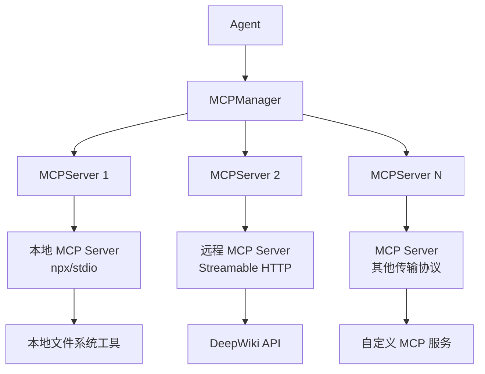

## 工具过滤机制

框架支持静态工具过滤，允许开发者限制 Agent 可访问的 MCP 工具范围。这对于安全控制和界面简化非常重要。

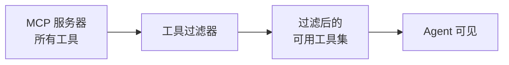

工具过滤通过 `MCPToolFilter` 接口实现，开发者可以自定义过滤规则：

```python
# 伪代码示例
tool_filter = ToolFilter(allowed_tools=["read_file", "write_file"])
agent = Agent(..., mcp_servers=[server], tool_filter=tool_filter)
```

## 审批流程集成

MCP 工具调用支持 `require_approval` 配置选项，实现人机协作审批流程。

### 审批设置类型

| 设置值 | 说明 |
|--------|------|
| `"always"` | 每次工具调用都需要人工审批 |
| `"never"` | 不需要审批，自动执行 |
| `Callable` | 自定义审批逻辑函数 |

### 审批逻辑处理

```python
# 来自 server.py 的审批逻辑签名
@staticmethod
def _normalize_needs_approval(
    *,
    require_approval: RequireApprovalSetting,
) -> (
    bool
    | dict[str, bool]
    | Callable[[RunContextWrapper[Any], AgentBase, MCPTool], MaybeAwaitable[bool]]
)
```

开发者可以传入布尔值、字典或可调用对象来自定义审批行为。当设置为 `"always"` 时，框架会自动进入 HITL（Human-In-The-Loop）流程，等待人工确认后继续执行。

## 资源管理

MCP 服务器可以暴露两种类型的资源访问接口：

### 资源列表

`list_resources` 方法返回服务器上可用的资源列表，支持分页：

```python
async def list_resources(self, cursor: str | None = None) -> ListResourcesResult:
    """
    Args:
        cursor: 分页游标，用于获取下一页结果
    """
```

返回结果包含 `nextCursor` 字段用于后续分页请求。

### 资源模板

`list_resource_templates` 方法列出资源模板，模板支持参数化资源访问：

```python
async def list_resource_templates(
    self, cursor: str | None = None
) -> ListResourceTemplatesResult:
    """
    支持的参数化资源模板查询
    """
```

### 资源读取

`read_resource` 方法根据 URI 读取具体资源内容：

```python
async def read_resource(self, uri: str) -> ReadResourceResult:
    """
    Args:
        uri: 资源的 URI 地址
    """
```

## 连接示例

### 本地 MCP 服务器

通过 `npx` 启动本地文件系统 MCP 服务器：

```bash
npx -y @modelcontextprotocol/server-filesystem /path/to/directory
```

在代码中配置：

```python
from agents import Agent, MCPServer
from agents.mcp import StreamableHTTPServer

server = StreamableHTTPServer(
    name="filesystem",
    command="npx",
    args=["-y", "@modelcontextprotocol/server-filesystem", "/path/to/directory"]
)

agent = Agent(mcp_servers=[server])
```

### 远程 MCP 服务器

通过 Streamable HTTP 协议连接远程 MCP 服务器：

```python
from agents.mcp import StreamableHTTPServer

server = StreamableHTTPServer(
    name="deepwiki",
    url="https://mcp.deepwiki.com/mcp",
    auth_token="your-auth-token"  # 可选
)

agent = Agent(mcp_servers=[server])
```

## 错误处理

框架为 MCP 操作定义了专门的异常类型：

| 异常类型 | 触发场景 |
|----------|----------|
| `NotImplementedError` | 服务器不支持特定功能（如资源读取） |
| `ExecNonZeroError` | 命令执行返回非零退出码 |
| `InvalidManifestPathError` | manifest 路径无效（exit_code=111） |
| `WorkspaceArchiveWriteError` | 工作空间归档写入失败 |

## 应用场景

### 1. 文件系统访问

使用官方 MCP 文件系统服务器，为 Agent 添加读写本地文件的能力。

### 2. 外部 API 集成

通过 MCP 协议连接第三方服务（如 DeepWiki），扩展 Agent 的知识获取能力。

### 3. 数据库操作

部署自定义 MCP 服务器，实现结构化数据查询和操作。

### 4. 开发工具集成

集成开发相关的 MCP 工具，如代码搜索、版本控制、持续集成等。

## 配置选项

| 选项 | 类型 | 默认值 | 说明 |
|------|------|--------|------|
| `timeout` | `float` | 60.0 | 工具调用超时时间（秒） |
| `require_approval` | `str\|Callable` | `"never"` | 工具调用审批设置 |
| `tool_filter` | `ToolFilter` | `None` | 工具过滤规则 |
| `env_vars` | `dict` | `{}` | 传递给服务器的环境变量 |

## 相关资源

- 官方 MCP 服务器列表：[Model Context Protocol Servers](https://github.com/modelcontextprotocol/servers)
- MCP 协议规范：[MCP Protocol Specification](https://modelcontextprotocol.io/specification)

---

<a id='handoffs'></a>

## Agent 转交机制

### 相关页面

相关主题：[Agent 核心框架](#agent-core), [核心概念](#core-concepts)

<details>
<summary>相关源码文件</summary>

以下源码文件用于生成本页说明：

- [src/agents/handoffs/__init__.py](https://github.com/openai/openai-agents-python/blob/main/src/agents/handoffs/__init__.py)
- [src/agents/handoffs/history.py](https://github.com/openai/openai-agents-python/blob/main/src/agents/handoffs/history.py)
- [src/agents/extensions/handoff_filters.py](https://github.com/openai/openai-agents-python/blob/main/src/agents/extensions/handoff_filters.py)
- [src/agents/extensions/handoff_prompt.py](https://github.com/openai/openai-agents-python/blob/main/src/agents/extensions/handoff_prompt.py)
- [examples/handoffs/message_filter.py](https://github.com/openai/openai-agents-python/blob/main/examples/handoffs/message_filter.py)
</details>

# Agent 转交机制

## 概述

Agent 转交（Handoff）机制是 openai-agents-python 框架中实现多代理协作的核心功能。该机制允许一个 Agent 在执行过程中将控制权转移给另一个 Agent，同时支持传递上下文信息、过滤输入内容、以及管理对话历史。

转交机制在以下场景中发挥关键作用：

- 将复杂任务分解为多个专门化的子任务
- 实现代理之间的专业分工（如数据分析代理、写作代理、审核代理）
- 支持条件分支和动态路由
- 管理用户请求与专门代理之间的映射关系

## 核心组件

### Handoff 类

`Handoff` 类是转交机制的核心数据模型，封装了转交的所有配置信息。

| 属性 | 类型 | 说明 |
|------|------|------|
| `name` | `str` | 转交工具的名称 |
| `tool_description` | `str` | 转交工具的描述，供 LLM 理解何时触发转交 |
| `input_json_schema` | `dict[str, Any]` | 转交工具调用参数的 JSON Schema |
| `on_invoke_handoff` | `Callable[[RunContextWrapper[Any], str], Awaitable[TAgent]]` | 执行转交的回调函数，接收运行上下文和 JSON 参数字符串，返回目标 Agent |
| `agent_name` | `str` | 目标 Agent 的名称 |
| `input_filter` | `HandoffInputFilter \| None` | 过滤传递给下一 Agent 的输入历史 |
| `on_handoff` | `Callable \| None` | 转交触发时执行的副作用函数 |
| `input_type` | `type \| None` | 转交参数的 Pydantic 类型定义 |
| `nest_handoff_history` | `bool \| None` | 是否嵌套转交历史摘要 |
| `is_enabled` | `bool \| Callable[[RunContextWrapper[Any], AgentBase, MCPTool], bool]` | 转交是否启用，支持动态判断 |

资料来源：[src/agents/handoffs/__init__.py]()

### HandoffInputFilter 过滤器

`HandoffInputFilter` 是一个函数类型，用于在转交发生时过滤和转换传递给下一 Agent 的输入历史。

```python
HandoffInputFilter = Callable[
    [list[RunItem], HandoffInputData], tuple[list[RunItem], list[TResponseInputItem]]
]
```

该函数接收：
- 转交前的完整运行项列表
- `HandoffInputData` 对象

返回经过过滤和修改后的运行项列表以及新的输入项列表。

资料来源：[src/agents/handoffs/history.py]()

### HandoffInputData 数据结构

```python
class HandoffInputData:
    input_history: list[RunItem]
    pre_handoff_items: list[RunItem]
```

| 属性 | 类型 | 说明 |
|------|------|------|
| `input_history` | `list[RunItem]` | 整个对话历史 |
| `pre_handoff_items` | `list[RunItem]` | 转交触发前的运行项集合 |

资料来源：[src/agents/handoffs/history.py]()

## 转交工作流程

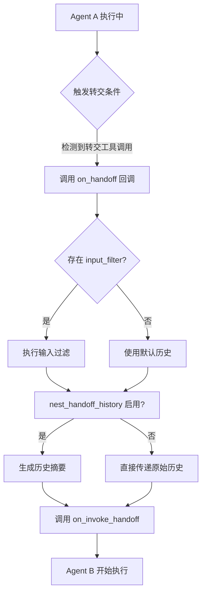

## 历史管理机制

### 嵌套历史摘要

当 `nest_handoff_history` 设置为 `True` 时，系统会对转交前的对话历史进行压缩摘要处理，以避免上下文窗口溢出。

```python
def nest_handoff_history(
    handoff_input_data: HandoffInputData,
    *,
    history_mapper: HandoffHistoryMapper | None = None,
) -> HandoffInputData:
    """Summarize the previous transcript for the next agent."""
```

处理流程：

1. **规范化历史** - 调用 `_normalize_input_history()` 标准化输入格式
2. **扁平化嵌套** - 调用 `_flatten_nested_history_messages()` 处理嵌套结构
3. **转换格式** - 将 `RunItem` 转换为 `TResponseInputItem`
4. **过滤项目** - 跳过 `ToolApprovalItem` 等特定类型
5. **生成摘要** - 使用 LLM 生成压缩后的历史摘要

资料来源：[src/agents/handoffs/history.py]()

### 历史包装器

系统使用标记符号包围嵌套的历史摘要：

```python
_DEFAULT_CONVERSATION_HISTORY_START = "<CONVERSATION HISTORY>"
_DEFAULT_CONVERSATION_HISTORY_END = "</CONVERSATION HISTORY>"
```

可通过以下函数自定义：

```python
set_conversation_history_wrappers(start="<HISTORY>", end="</HISTORY>")
reset_conversation_history_wrappers()
get_conversation_history_wrappers() -> tuple[str, str]
```

资料来源：[src/agents/handoffs/history.py]()

## 输入过滤详解

### 过滤执行流程

```mermaid
graph LR
    A[原始输入历史] --> B[HandoffInputFilter]
    B --> C[过滤后的历史]
    B --> D[新增输入项]
    C --> E[传递给目标 Agent]
    D --> E
```

### 内置过滤器

框架在 `src/agents/extensions/handoff_filters.py` 中提供了常用的过滤器实现：

| 过滤器 | 功能描述 |
|--------|----------|
| `filter_tool_messages` | 移除历史中的工具调用消息 |
| `filter_non_agent_messages` | 仅保留 Agent 生成的消息 |
| `filter_by_role` | 按角色过滤消息 |
| `truncate_history` | 截断过长的历史记录 |

资料来源：[src/agents/extensions/handoff_filters.py]()

### 自定义过滤器示例

```python
def my_input_filter(
    items: list[RunItem], 
    data: HandoffInputData
) -> tuple[list[RunItem], list[TResponseInputItem]]:
    # 只保留最近10条消息
    recent_items = items[-10:]
    new_items = [create_summary_item(data)]
    return recent_items, new_items

handoff = Handoff(
    name="transfer_to_analyst",
    agent_name="analyst",
    on_invoke_handoff=invoke_analyst,
    input_filter=my_input_filter,
)
```

## 转交提示词

### 提示词模板

系统在 `src/agents/extensions/handoff_prompt.py` 中定义了转交相关的提示词模板，用于指导 LLM 理解何时以及如何触发转交。

主要提示词组件包括：

| 组件 | 用途 |
|------|------|
| `handoff_trigger_prompt` | 指导 LLM 判断触发转交的时机 |
| `handoff_args_prompt` | 指导 LLM 生成转交参数 |
| `handoff_summary_prompt` | 用于生成历史摘要 |

资料来源：[src/agents/extensions/handoff_prompt.py]()

## 高级配置

### 条件启用转交

```python
def dynamic_enabled(
    context: RunContextWrapper[Any], 
    agent: AgentBase, 
    tool: MCPTool
) -> bool:
    # 根据上下文条件判断是否启用
    return context.metadata.get("user_tier") == "premium"

handoff = Handoff(
    name="transfer_to_expert",
    agent_name="expert",
    on_invoke_handoff=invoke_expert,
    is_enabled=dynamic_enabled,
)
```

### 带参数的转交

```python
from pydantic import BaseModel

class TransferArgs(BaseModel):
    reason: str
    priority: str = "normal"

def handle_handoff(context: RunContextWrapper, args: TransferArgs):
    logger.info(f"Transferring to expert: {args.reason}")
    return expert_agent

handoff = Handoff(
    name="transfer_to_expert",
    agent_name="expert",
    on_invoke_handoff=handle_handoff,
    input_type=TransferArgs,
    on_handoff=lambda ctx, args: print(f"Transfer: {args}"),
)
```

### 禁用转交

```python
# 完全禁用
handoff = Handoff(
    name="transfer_to_debug",
    agent_name="debugger",
    on_invoke_handoff=invoke_debugger,
    is_enabled=False,  # 对 LLM 隐藏此转交
)
```

## 使用示例

### 基本转交模式

```python
from agents import Agent, Runner, handoff

# 定义两个 Agent
general_agent = Agent(
    name="general",
    instructions="你是一个通用助手。",
    handoffs=[
        handoff(
            agent=analytics_agent,
            on_handoff=lambda ctx, input: print("转移到分析代理")
        )
    ]
)

analytics_agent = Agent(
    name="analytics",
    instructions="你是一个数据分析专家。"
)

# 执行转交
result = await Runner.run(general_agent, "分析本月的销售数据")
```

### 带输入过滤的转交

```python
from agents.handoffs import HandoffInputFilter

def clean_history_filter(
    items: list[RunItem], 
    data: HandoffInputData
) -> tuple[list[RunItem], list[TResponseInputItem]]:
    # 移除所有工具调用记录
    clean_items = [i for i in items if not isinstance(i, ToolCallItem)]
    return clean_items, []

handoff = Handoff(
    name="escalate",
    agent_name="supervisor",
    on_invoke_handoff=invoke_supervisor,
    input_filter=clean_history_filter,
)
```

资料来源：[examples/handoffs/message_filter.py]()

## 错误处理

### 常见错误场景

| 错误类型 | 触发条件 | 处理建议 |
|----------|----------|----------|
| `UserError` | 提供了 `input_type` 但未提供 `on_handoff` | 确保两者同时配置 |
| `UserError` | `on_handoff` 参数数量不为 2 | 回调必须接收 `context` 和 `input` 两个参数 |
| `NotImplementedError` | MCP 服务器不支持特定资源操作 | 检查服务器能力 |

资料来源：[src/agents/handoffs/__init__.py](), [src/agents/mcp/server.py]()

## 架构总结

```mermaid
graph TD
    subgraph "转交发起方"
        A[Agent A] --> B[Handoff 配置]
        B --> C[工具调用]
    end
    
    subgraph "转交处理"
        C --> D[on_handoff 回调]
        D --> E[input_filter 处理]
        E --> F[历史摘要生成]
        F --> G[on_invoke_handoff]
    end
    
    subgraph "转交接收方"
        G --> H[Agent B]
        H --> I[处理任务]
    end
```

Agent 转交机制通过解耦转交配置、转交执行、输入处理和历史管理四个关键环节，实现了灵活且可扩展的多代理协作模式。开发者可以通过组合不同的过滤器、回调函数和配置选项，构建复杂的代理工作流程。

---

<a id='guardrails'></a>

## Guardrails 安全机制

### 相关页面

相关主题：[Agent 核心框架](#agent-core)

<details>
<summary>相关源码文件</summary>

以下源码文件用于生成本页说明：

- [src/agents/guardrail.py](https://github.com/openai/openai-agents-python/blob/main/src/agents/guardrail.py)
- [src/agents/tool_guardrails.py](https://github.com/openai/openai-agents-python/blob/main/src/agents/tool_guardrails.py)
- [src/agents/run_internal/guardrails.py](https://github.com/openai/openai-agents-python/blob/main/src/agents/run_internal/guardrails.py)
- [examples/agent_patterns/input_guardrails.py](https://github.com/openai/openai-agents-python/blob/main/examples/agent_patterns/input_guardrails.py)
- [examples/agent_patterns/output_guardrails.py](https://github.com/openai/openai-agents-python/blob/main/examples/agent_patterns/output_guardrails.py)
</details>

# Guardrails 安全机制

## 概述

Guardrails（安全护栏）机制是 openai-agents-python 框架中用于验证和过滤输入输出内容的关键安全组件。该机制在整个 Agent 运行周期中提供多层次的防护，确保模型行为符合预期规范，防止敏感信息泄露和危险操作执行。

Guardrails 系统主要解决以下安全问题：

- **输入验证**：在用户输入到达 Agent 之前进行安全检查
- **输出过滤**：对模型生成的内容进行合规性验证
- **工具调用保护**：在工具输入和输出阶段进行安全校验
- **追踪审计**：记录安全检查的触发和执行情况

## 架构设计

### 整体架构

```mermaid
graph TD
    A[用户输入] --> B[输入 Guardrails 检查]
    B --> C{检查结果}
    C -->|通过| D[Agent 处理]
    C -->|触发| E[拒绝/拦截]
    D --> F[模型响应]
    F --> G[输出 Guardrails 检查]
    G --> H{检查结果}
    H -->|通过| I[返回结果]
    H -->|触发| J[内容过滤/拒绝]
    D --> K[工具调用]
    K --> L[工具输入 Guardrails]
    K --> M[工具执行]
    M --> N[工具输出 Guardrails]
```

### 组件层次

Guardrails 机制由以下核心组件构成：

| 组件 | 文件位置 | 职责 |
|------|----------|------|
| `Guardrail` | `src/agents/guardrail.py` | 基础 Guardrail 抽象类定义 |
| `ToolInputGuardrail` | `src/agents/tool_guardrails.py` | 工具输入验证 |
| `ToolOutputGuardrail` | `src/agents/tool_guardrails.py` | 工具输出验证 |
| `InputGuardrailFunction` | `examples/agent_patterns/input_guardrails.py` | 输入检查函数示例 |
| `OutputGuardrailFunction` | `examples/agent_patterns/output_guardrails.py` | 输出检查函数示例 |

## 核心类型定义

### GuardrailSpanData

在追踪系统中，Guardrail 的执行状态通过 `GuardrailSpanData` 进行封装：

```python
class GuardrailSpanData:
    name: str           # Guardrail 名称标识
    triggered: bool    # 是否被触发
```

### Guardrail 函数签名

```python
async def guardrail_function(
    ctx: RunContext,
    agent: Agent,
    input: str | list[Message]
) -> GuardrailResult:
    """
    Args:
        ctx: 运行上下文
        agent: 当前 Agent 实例
        input: 待验证的输入内容
    Returns:
        GuardrailResult: 包含触发状态和输出信息
    """
```

## 输入 Guardrails

### 功能描述

输入 Guardrails 在用户输入进入 Agent 处理流程之前进行安全检查。资料来源：[examples/agent_patterns/input_guardrails.py:1-50]()

### 配置方式

```python
from agents import Agent, InputGuardrail, InputGuardrailFunction

async def check_sensitive_input(ctx, agent, input) -> GuardrailResult:
    """检查输入是否包含敏感内容"""
    if contains_problematic_content(input):
        return GuardrailResult(
            triggerred=True,
            message="输入包含敏感内容，已被拦截"
        )
    return GuardrailResult(triggerred=False)

agent = Agent(
    name="安全助手",
    instructions="你是一个有帮助的助手",
    input_guardrails=[
        InputGuardrail(function=check_sensitive_input)
    ]
)
```

### 执行流程

```mermaid
sequenceDiagram
    participant U as 用户输入
    participant IG as 输入 Guardrail
    participant A as Agent
    participant T as 追踪系统

    U->>IG: 原始输入内容
    IG->>T: guardrail_span(name="input_check")
    IG->>IG: 执行检查逻辑
    alt 检查通过
        IG->>A: 传递输入
        A-->>U: 正常响应
    else 检查触发
        IG-->>U: 返回错误信息
    end
```

## 输出 Guardrails

### 功能描述

输出 Guardrails 负责在模型生成响应后、返回给用户之前进行内容验证和过滤。资料来源：[examples/agent_patterns/output_guardrails.py:1-50]()

### 配置方式

```python
from agents import Agent, OutputGuardrail, OutputGuardrailFunction

async def check_output_content(ctx, agent, output) -> GuardrailResult:
    """检查输出内容的安全性"""
    if contains_harmful_content(output.content):
        return GuardrailResult(
            triggerred=True,
            message="输出内容包含不当信息"
        )
    return GuardrailResult(triggerred=False)

agent = Agent(
    name="内容审核助手",
    instructions="生成安全的内容",
    output_guardrails=[
        OutputGuardrail(function=check_output_content)
    ]
)
```

## 工具级 Guardrails

### 工具输入检查

ToolInputGuardrail 在工具执行前验证传入参数的安全性：

```python
class ToolInputGuardrail(Guardrail):
    """工具输入安全检查"""
    
    async def check(
        self,
        ctx: RunContext,
        agent: Agent,
        tool: Tool,
        input_data: dict
    ) -> GuardrailResult:
        # 验证输入参数是否符合预期格式和范围
        pass
```

### 工具输出检查

ToolOutputGuardrail 在工具执行后验证返回结果：

```python
class ToolOutputGuardrail(Guardrail):
    """工具输出安全检查"""
    
    async def check(
        self,
        ctx: RunContext,
        agent: Agent,
        tool: Tool,
        output: Any
    ) -> GuardrailResult:
        # 验证输出是否包含敏感信息
        pass
```

### 执行上下文

工具级 Guardrails 的检查结果通过 `tool_input_guardrail_results` 和 `tool_output_guardrail_results` 参数在执行流程中传递。资料来源：[src/agents/run_internal/turn_resolution.py:50-80]()

## 追踪与监控

### Guardrail Span 创建

每个 Guardrail 检查都会生成对应的追踪 Span：

```python
def guardrail_span(
    name: str,
    triggered: bool = False,
    span_id: str | None = None,
    parent: Trace | Span[Any] | None = None,
    disabled: bool = False,
) -> Span[GuardrailSpanData]:
    """创建 Guardrail 追踪 Span"""
```

资料来源：[src/agents/tracing/create.py:40-60]()

### 追踪数据结构

```mermaid
classDiagram
    class GuardrailSpanData {
        +str name
        +bool triggered
    }
    
    class Span {
        +start()
        +finish()
        +set_status()
    }
    
    class Trace {
        +create_span()
        +get_spans()
    }
    
    Span --> GuardrailSpanData
    Trace ..> Span : creates
```

## Agent 配置集成

### 完整配置示例

```python
from agents import Agent, RunContext

agent = Agent(
    name="安全问答助手",
    instructions="提供安全、准确的信息",
    input_guardrails=[
        InputGuardrail(function=validate_user_input),
    ],
    output_guardrails=[
        OutputGuardrail(function=validate_model_output),
    ],
    tool_input_guardrails=[
        ToolInputGuardrail(function=validate_tool_params),
    ],
    tool_output_guardrails=[
        ToolOutputGuardrail(function=validate_tool_result),
    ],
)
```

### 配置参数说明

| 参数 | 类型 | 说明 | 必填 |
|------|------|------|------|
| `input_guardrails` | `list[InputGuardrail]` | 输入检查列表 | 否 |
| `output_guardrails` | `list[OutputGuardrail]` | 输出检查列表 | 否 |
| `tool_input_guardrails` | `list[ToolInputGuardrail]` | 工具输入检查 | 否 |
| `tool_output_guardrails` | `list[ToolOutputGuardrail]` | 工具输出检查 | 否 |

## 执行流程详解

### 单轮对话中的 Guardrails 执行

```mermaid
graph LR
    subgraph 输入阶段
        A1[用户消息] --> A2[Input Guardrails]
        A2 --> A3{触发?}
    end
    
    subgraph 处理阶段
        A3 -->|否| B1[Agent 处理]
        B1 --> B2[工具调用]
    end
    
    subgraph 工具阶段
        B2 --> C1[Tool Input Guardrails]
        C1 --> C2{触发?}
        C2 -->|是| C4[拦截]
        C2 -->|否| B3[执行工具]
        B3 --> C3[Tool Output Guardrails]
        C3 --> C5{触发?}
        C5 -->|是| C4
    end
    
    subgraph 输出阶段
        C5 -->|否| D1[Agent 响应生成]
        D1 --> D2[Output Guardrails]
        D2 --> D3{触发?}
        D3 -->|否| D4[返回结果]
        D3 -->|是| D5[返回错误]
    end
```

### 检查结果处理

当 Guardrail 被触发时，系统会中断当前执行流程：

1. **输入检查触发**：返回验证错误，拒绝处理请求
2. **输出检查触发**：过滤或拒绝返回内容
3. **工具检查触发**：阻止工具执行或过滤返回数据

资料来源：[src/agents/run_internal/guardrails.py:1-100]()

## 最佳实践

### 1. 分层检查策略

建议采用多层防护策略：

```python
# 基础层：快速检查
async def basic_check(ctx, agent, input):
    # 使用正则或关键词快速匹配
    pass

# 深度层：复杂分析
async def deep_check(ctx, agent, input):
    # 使用模型或更复杂的逻辑
    pass

agent = Agent(
    input_guardrails=[
        InputGuardrail(function=basic_check, timeout=1.0),
        InputGuardrail(function=deep_check, timeout=10.0),
    ]
)
```

### 2. 性能优化

- 将简单快速的检查放在前面
- 使用缓存避免重复检查
- 设置合理的超时时间

### 3. 错误处理

```python
async def safe_guardrail(ctx, agent, input):
    try:
        return await perform_check(input)
    except CheckError as e:
        # 保守策略：检查失败时拒绝
        return GuardrailResult(triggerred=True, message=str(e))
```

## 与其他系统的协作

### 与 Tracing 系统集成

Guardrails 的执行状态会自动记录到追踪系统中，便于审计和问题排查。

### 与 Handoff 系统协作

在 Agent 间交接时，Guardrail 配置会随 Agent 定义一起传递，但历史对话内容不重复检查。资料来源：[src/agents/handoffs/history.py:1-50]()

## 总结

Guardrails 安全机制为 openai-agents-python 提供了完整的多层次安全防护能力，覆盖从用户输入到模型输出再到工具调用的完整流程。通过灵活的接口设计，开发者可以轻松实现自定义的安全检查逻辑，同时追踪系统提供了完整的审计能力。

---

<a id='sandbox-agent'></a>

## 沙箱 Agent 概述

### 相关页面

相关主题：[沙箱会话管理](#sandbox-session)

<details>
<summary>相关源码文件</summary>

以下源码文件用于生成本页说明：

- [src/agents/sandbox/sandbox_agent.py](https://github.com/openai/openai-agents-python/blob/main/src/agents/sandbox/sandbox_agent.py)
- [src/agents/sandbox/runtime.py](https://github.com/openai/openai-agents-python/blob/main/src/agents/sandbox/runtime.py)
- [src/agents/sandbox/manifest.py](https://github.com/openai/openai-agents-python/blob/main/src/agents/sandbox/manifest.py)
- [src/agents/sandbox/capabilities/capabilities.py](https://github.com/openai/openai-agents-python/blob/main/src/agents/sandbox/capabilities/capabilities.py)
- [examples/sandbox/basic.py](https://github.com/openai/openai-agents-python/blob/main/examples/sandbox/basic.py)
- [examples/sandbox/README.md](https://github.com/openai/openai-agents-python/blob/main/examples/sandbox/README.md)
- [examples/sandbox/extensions/README.md](https://github.com/openai/openai-agents-python/blob/main/examples/sandbox/extensions/README.md)
- [src/agents/sandbox/util/tar_utils.py](https://github.com/openai/openai-agents-python/blob/main/src/agents/sandbox/util/tar_utils.py)
- [examples/sandbox/tutorials/dataroom_metric_extract/README.md](https://github.com/openai/openai-agents-python/blob/main/examples/sandbox/tutorials/dataroom_metric_extract/README.md)
- [examples/sandbox/tutorials/repo_code_review/README.md](https://github.com/openai/openai-agents-python/blob/main/examples/sandbox/tutorials/repo_code_review/README.md)
</details>

# 沙箱 Agent 概述

## 简介

沙箱 Agent（Sandbox Agent）是 openai-agents-python 框架中用于在隔离环境中执行 AI 代理任务的组件。沙箱提供了安全的运行时环境，代理可以在其中执行文件操作、运行命令、安装依赖等操作，而不会影响宿主机系统。

沙箱 Agent 的核心价值在于：

- **隔离性**：代理在独立的虚拟工作空间中运行，与宿主环境完全隔离
- **安全性**：通过路径验证和权限控制防止恶意操作
- **可重现性**：支持快照（Snapshot）和持久化工作区，便于恢复和复用
- **多后端支持**：支持多种沙箱提供商，包括 E2B、Modal、Cloudflare、Blaxel、Vercel、Daytona 等

资料来源：[examples/sandbox/README.md:1-15]()

## 核心组件

### 组件架构图

```mermaid
graph TD
    A[用户代码] --> B[SandboxAgent]
    B --> C[SandboxRuntime]
    C --> D[Manifest]
    C --> E[Capabilities]
    D --> F[Workspace]
    E --> G[Shell工具]
    E --> H[File工具]
    E --> I[其他工具]
    F --> J[E2B后端]
    F --> K[Modal后端]
    F --> L[Cloudflare后端]
    F --> M[其他后端]
```

### SandboxAgent

`SandboxAgent` 是沙箱代理的核心类，继承自 `AgentBase`。它负责在沙箱环境中执行代理任务。

**主要职责：**

- 创建和管理沙箱会话
- 配置工作区清单（Manifest）
- 应用沙箱能力（Capabilities）
- 处理代理与沙箱之间的交互

资料来源：[src/agents/sandbox/sandbox_agent.py]()

### SandboxRuntime

`SandboxRuntime` 是沙箱的运行时环境，负责实际执行命令和文件操作。

**主要职责：**

- 初始化沙箱会话
- 执行 shell 命令
- 管理文件系统操作
- 处理工作区持久化

资料来源：[src/agents/sandbox/runtime.py]()

### Manifest

Manifest 定义了沙箱工作区的初始状态和配置。它描述了需要注入到沙箱中的文件、目录和环境变量。

**Manifest 核心配置项：**

| 配置项 | 类型 | 说明 |
|--------|------|------|
| `name` | str | Manifest 名称 |
| `description` | str | 描述信息 |
| `image` | str | 容器镜像（可选） |
| `env_vars` | dict | 环境变量 |
| `files` | list | 要注入的文件列表 |
| `setup` | list | 初始化命令列表 |
| `index_url` | str | Python 包索引 URL |

资料来源：[src/agents/sandbox/manifest.py]()

### Capabilities

Capabilities 定义了沙箱代理可以使用的工具集。这些能力通过 `SandboxToolset` 提供给代理使用。

**内置能力：**

| 能力名称 | 说明 |
|----------|------|
| `bash` | 执行 bash 命令 |
| `read` | 读取文件内容 |
| `write` | 写入文件内容 |
| `edit` | 编辑文件 |
| `glob` | 文件模式匹配 |
| `grep` | 文本搜索 |
| `web_search` | 网络搜索 |

资料来源：[src/agents/sandbox/capabilities/capabilities.py]()

## 快速开始

### 基础使用示例

以下示例展示了如何创建和运行一个基本的沙箱 Agent：

```python
from agents import SandboxAgent, Runner
from agents.sandbox import Sandbox

async def main():
    sandbox = Sandbox()
    
    agent = SandboxAgent(
        name="文件分析助手",
        instructions="分析工作区中的文件并提供摘要",
        sandbox=sandbox,
    )
    
    result = await Runner.run(agent, "查看当前目录下的所有 Python 文件")
    print(result.final_output)
```

资料来源：[examples/sandbox/basic.py:1-30]()

### 带 Manifest 的配置

```python
from agents import SandboxAgent, Runner
from agents.sandbox import Sandbox, Manifest

async def main():
    manifest = Manifest(
        name="数据分析环境",
        description="用于数据分析的 Python 环境",
        files=[
            {"path": "data.csv", "content": "..."},
        ],
        setup=[
            "pip install pandas numpy",
        ],
    )
    
    sandbox = Sandbox(manifest=manifest)
    agent = SandboxAgent(
        name="数据分析师",
        instructions="使用 Python 分析数据文件",
        sandbox=sandbox,
    )
```

## 工作流程

### 执行流程图

```mermaid
sequenceDiagram
    participant User as 用户
    participant Agent as SandboxAgent
    participant Runtime as SandboxRuntime
    participant Sandbox as Sandbox Backend
    participant Workspace as Workspace

    User->>Agent: 启动代理
    Agent->>Runtime: 初始化沙箱
    Runtime->>Sandbox: 创建会话
    Sandbox->>Workspace: 注入 Manifest
    Workspace-->>Sandbox: 工作区就绪
    Sandbox-->>Runtime: 会话建立
    Runtime-->>Agent: 沙箱就绪
    Agent->>Runtime: 执行任务
    Runtime->>Workspace: 文件操作
    Runtime->>Sandbox: Shell 命令
    Workspace-->>Runtime: 结果
    Sandbox-->>Runtime: 输出
    Runtime-->>Agent: 任务结果
    Agent-->>User: 最终输出
```

### Manifest 处理流程

1. **Manifest 验证**：检查 Manifest 配置的有效性
2. **文件注入**：将 Manifest 中定义的文件注入到工作区
3. **环境设置**：配置环境变量和初始化命令
4. **路径解析**：验证所有路径都在工作区根目录内

资料来源：[src/agents/sandbox/util/tar_utils.py:1-50]()

## 多后端支持

框架支持多种沙箱后端实现，开发者可以根据需求选择合适的后端。

### 支持的后端

| 后端 | 说明 | 特点 |
|------|------|------|
| E2B | 云端沙箱服务 | 成熟稳定，支持 PTY |
| Modal | Modal 平台沙箱 | 支持持久化工作区 |
| Cloudflare | Cloudflare 沙箱 | 支持云存储挂载 |
| Blaxel | Blaxel 平台 | 支持 Drive 挂载 |
| Vercel | Vercel 平台 | 支持 Node.js 运行时 |
| Daytona | Daytona 沙箱 | 轻量级方案 |

资料来源：[examples/sandbox/extensions/README.md:1-100]()

### 后端选择示例

```python
# 使用 E2B 后端
sandbox = Sandbox(backend="e2b")

# 使用 Modal 后端
sandbox = Sandbox(backend="modal")

# 使用自定义后端
from agents.sandbox.backends.modal import ModalSandbox
sandbox = ModalSandbox(
    app_name="my-sandbox",
    workspace_persistence="snapshot"
)
```

## 工具集成

### 沙箱代理与工具的结合

沙箱 Agent 可以与其他框架工具结合使用，实现更复杂的功能。

```python
from agents import SandboxAgent, Runner, function_tool

@function_tool
def get_external_data(query: str) -> str:
    """获取外部数据源"""
    return f"External data for: {query}"

async def main():
    sandbox = Sandbox()
    
    agent = SandboxAgent(
        name="研究助手",
        instructions="结合外部数据和沙箱内文件完成研究任务",
        sandbox=sandbox,
        tools=[get_external_data],
    )
    
    result = await Runner.run(
        agent, 
        "分析沙箱中的数据并结合外部信息源给出建议"
    )
```

资料来源：[examples/sandbox/sandbox_agent_with_tools.py]()

### 工作区能力

沙箱 Agent 可以配置工作区能力（Workspace Capabilities），以更精细地控制代理的操作范围。

```python
from agents.sandbox.capabilities import (
    WorkspaceCapabilities,
    BashCapability,
    FileReadCapability,
)

capabilities = WorkspaceCapabilities(
    tools=[
        BashCapability(timeout=30),
        FileReadCapability(allowed_paths=["/workspace/data"]),
    ],
)

sandbox = Sandbox(capabilities=capabilities)
```

资料来源：[src/agents/sandbox/capabilities/capabilities.py]()

## 安全机制

### 路径安全

框架实现了多层路径安全检查，防止路径遍历攻击：

1. **根目录限制**：所有文件操作必须在工作区根目录下
2. **符号链接检查**：禁止通过符号链接访问工作区外的路径
3. **符号链接验证**：检查 tar 包中的符号链接是否安全

```python
def validate_tarfile(
    tar: tarfile.TarFile,
    *,
    reject_symlink_rel_paths: Iterable[str | Path] = (),
    skip_rel_paths: Iterable[str | Path] = (),
    root_name: str | None = None,
    allow_symlinks: bool = True,
    allow_external_symlink_targets: bool = True,
) -> None:
    # 检查路径是否逃逸根目录
    # 验证符号链接安全性
```

资料来源：[src/agents/sandbox/util/tar_utils.py:50-100]()

### 执行权限控制

- **命令白名单**：可以配置允许执行的命令列表
- **超时控制**：防止无限循环或长时间运行
- **资源限制**：限制 CPU、内存使用

## 持久化与快照

### 工作区持久化

沙箱支持多种工作区持久化策略：

| 策略 | 说明 | 适用场景 |
|------|------|----------|
| `tar` | 打包保存为 tar 文件 | 完整保存和传输 |
| `snapshot` | 创建快照 | 快速恢复 |
| `snapshot_filesystem` | 文件系统快照 | 大型工作区 |
| `snapshot_directory` | 目录快照 | 简单场景 |

```python
sandbox = Sandbox(
    workspace_persistence="tar",
    workspace_persistence_path="/path/to/save"
)
```

### 远程快照

支持从远程快照启动沙箱：

```python
sandbox = Sandbox(
    snapshot_url="https://storage.example.com/snapshots/snapshot-001.tar"
)
```

资料来源：[examples/sandbox/sandbox_agent_with_remote_snapshot.py]()

## 应用场景

### 数据分析

沙箱可以用于安全地分析敏感数据：

```mermaid
graph LR
    A[敏感数据] --> B[沙箱环境]
    B --> C[数据处理]
    C --> D[分析结果]
    D --> E[报告输出]
```

**示例流程：**

1. 将数据文件注入沙箱 Manifest
2. 在隔离环境中执行数据分析代码
3. 导出分析结果而不暴露原始数据

资料来源：[examples/sandbox/tutorials/dataroom_metric_extract/README.md:1-30]()

### 代码审查

沙箱可用于自动化的代码审查任务：

```mermaid
graph TD
    A[代码仓库] --> B[沙箱环境]
    B --> C[克隆代码]
    C --> D[运行审查工具]
    D --> E[生成报告]
    E --> F[修复建议]
```

资料来源：[examples/sandbox/tutorials/repo_code_review/README.md:1-25]()

### 自动化测试

沙箱提供隔离环境用于执行测试：

- 隔离测试环境，避免污染宿主系统
- 支持多种编程语言和测试框架
- 自动收集测试结果和覆盖率报告

## 配置选项

### Sandbox 构造函数参数

| 参数 | 类型 | 默认值 | 说明 |
|------|------|--------|------|
| `backend` | str | "e2b" | 沙箱后端类型 |
| `manifest` | Manifest | None | 工作区清单 |
| `capabilities` | Capabilities | None | 能力配置 |
| `timeout` | int | 300 | 超时时间（秒） |
| `workspace_persistence` | str | None | 持久化策略 |
| `workspace_persistence_path` | str | None | 持久化路径 |

### 环境变量

| 变量名 | 说明 |
|--------|------|
| `OPENAI_API_KEY` | OpenAI API 密钥（必需） |
| `E2B_API_KEY` | E2B 服务密钥 |
| `MODAL_TOKEN_ID` | Modal Token ID |
| `MODAL_TOKEN_SECRET` | Modal Token Secret |
| `CLOUDFLARE_SANDBOX_API_KEY` | Cloudflare API 密钥 |

## 最佳实践

### 1. Manifest 优化

- 仅注入必要的文件，减少启动时间
- 使用 `.dockerignore` 类似规则排除不相关文件
- 合理设置初始化命令，避免重复安装

### 2. 安全性考虑

- 始终设置合理的超时时间
- 使用路径白名单限制文件访问
- 避免在 Manifest 中包含敏感信息

### 3. 性能优化

- 对于重复任务，使用快照恢复而非重新初始化
- 合理配置并发沙箱数量
- 使用轻量级后端（如 Daytona）处理简单任务

### 4. 调试技巧

```python
# 启用详细日志
import logging
logging.basicConfig(level=logging.DEBUG)

# 使用暂停模式检查状态
sandbox = Sandbox(pause_on_exit=True)

# 查看沙箱输出
result = await Runner.run(agent, "ls -la", stream=True)
```

## 扩展开发

### 自定义后端

开发者可以实现 `SandboxBackend` 接口来添加新的沙箱后端：

```python
from agents.sandbox.backends.base import SandboxBackend

class MyCustomSandbox(SandboxBackend):
    async def create_session(self, manifest: Manifest) -> SandboxSession:
        # 实现自定义会话创建逻辑
        pass
    
    async def execute(self, command: str) -> ExecutionResult:
        # 实现命令执行逻辑
        pass
```

### 自定义能力

扩展沙箱能力以支持特定工具：

```python
from agents.sandbox.capabilities import BaseCapability

class CustomCapability(BaseCapability):
    name = "custom_tool"
    description = "自定义工具"
    
    def get_tools(self) -> list[FunctionTool]:
        return [self.custom_function_tool]
```

## 相关资源

- [沙箱基础示例](examples/sandbox/basic.py)
- [沙箱扩展后端](examples/sandbox/extensions/README.md)
- [沙箱教程 - 数据提取](examples/sandbox/tutorials/dataroom_metric_extract/README.md)
- [沙箱教程 - 代码审查](examples/sandbox/tutorials/repo_code_review/README.md)
- [沙箱教程 - 视觉网站克隆](examples/sandbox/tutorials/vision_website_clone/README.md)

---

<a id='sandbox-session'></a>

## 沙箱会话管理

### 相关页面

相关主题：[沙箱 Agent 概述](#sandbox-agent)

<details>
<summary>相关源码文件</summary>

以下源码文件用于生成本页说明：

- [src/agents/sandbox/session/sandbox_session.py](https://github.com/openai/openai-agents-python/blob/main/src/agents/sandbox/session/sandbox_session.py)
- [src/agents/sandbox/session/base_sandbox_session.py](https://github.com/openai/openai-agents-python/blob/main/src/agents/sandbox/session/base_sandbox_session.py)
- [src/agents/sandbox/session/manager.py](https://github.com/openai/openai-agents-python/blob/main/src/agents/sandbox/session/manager.py)
- [src/agents/sandbox/snapshot.py](https://github.com/openai/openai-agents-python/blob/main/src/agents/sandbox/snapshot.py)
- [src/agents/sandbox/files.py](https://github.com/openai/openai-agents-python/blob/main/src/agents/sandbox/files.py)
- [src/agents/sandbox/entries/artifacts.py](https://github.com/openai/openai-agents-python/blob/main/src/agents/sandbox/entries/artifacts.py)
</details>

# 沙箱会话管理

## 概述

沙箱会话管理是 openai-agents-python 框架中用于隔离执行 AI Agent 操作的核心子系统。它为每个 Agent 提供独立的虚拟工作空间，支持文件操作、命令执行、状态持久化以及工作区快照功能。沙箱机制确保 Agent 的操作不会影响主机系统安全，同时提供灵活的资源管理和跨后端支持。

## 核心架构

### 组件层次结构

沙箱会话管理系统由以下核心组件构成：

```mermaid
graph TD
    A[沙箱管理器 SessionManager] --> B[基础会话 BaseSandboxSession]
    B --> C[沙箱会话 SandboxSession]
    B --> D[工作区管理 FilesManager]
    B --> E[快照管理 SnapshotManager]
    C --> F[工件管理 ArtifactsManager]
    B --> G[后端实现 UnixLocal Cloudflare E2B Modal Vercel Daytona]
```

### 核心组件说明

| 组件 | 文件位置 | 职责 |
|------|---------|------|
| `SessionManager` | `src/agents/sandbox/session/manager.py` | 管理多个沙箱会话的生命周期、创建和销毁 |
| `BaseSandboxSession` | `src/agents/sandbox/session/base_sandbox_session.py` | 定义所有沙箱后端的抽象接口 |
| `SandboxSession` | `src/agents/sandbox/session/sandbox_session.py` | 提供具体的工作区操作实现 |
| `FilesManager` | `src/agents/sandbox/files.py` | 处理工作区的文件读写操作 |
| `SnapshotManager` | `src/agents/sandbox/snapshot.py` | 管理工作区的快照保存和恢复 |

## 会话生命周期管理

### 创建流程

```mermaid
sequenceDiagram
    participant 用户
    participant SessionManager
    participant BaseSandboxSession
    participant 后端实现
    participant Workspace

    用户->>SessionManager: 创建会话请求
    SessionManager->>BaseSandboxSession: 初始化沙箱后端
    BaseSandboxSession->>后端实现: 创建沙箱实例
    后端实现->>Workspace: 准备工作区
    Workspace-->>BaseSandboxSession: 工作区就绪
    BaseSandboxSession-->>SessionManager: 返回会话对象
    SessionManager-->>用户: 会话可用
```

### 核心方法

沙箱会话提供以下核心生命周期方法：

| 方法 | 功能 | 资料来源 |
|------|------|---------|
| `create()` | 创建新的沙箱会话实例 | `manager.py:1-50` |
| `close()` | 关闭并清理沙箱资源 | `manager.py:50-80` |
| `persist_workspace()` | 持久化当前工作区状态 | `base_sandbox_session.py:100-150` |
| `hydrate_workspace()` | 从归档恢复工作区 | `unix_local.py:200-250` |

## 工作区管理

### 工作区文件系统

沙箱工作区采用分层目录结构：

```mermaid
graph TD
    Workspace["工作区根目录"]
    Workspace --> Manifest["Manifest 定义"]
    Workspace --> Scratch["临时文件目录"]
    Workspace --> Output["输出产物目录"]
    
    Manifest --> Binaries["二进制文件"]
    Manifest --> SourceFiles["源码文件"]
    Manifest --> ConfigFiles["配置文件"]
```

### 文件操作接口

`FilesManager` 类提供统一的工作区文件操作接口，资料来源：`src/agents/sandbox/files.py`

| 方法 | 参数 | 返回值 | 说明 |
|------|------|--------|------|
| `write()` | `path`, `content` | `None` | 写入文件内容 |
| `read()` | `path` | `str` | 读取文件内容 |
| `list()` | `path` | `list[Path]` | 列出目录内容 |
| `delete()` | `path` | `None` | 删除文件或目录 |
| `exists()` | `path` | `bool` | 检查路径是否存在 |

### 安全机制

系统实现了多层安全防护来防止路径遍历攻击：

- **符号链接检查**：验证归档中的符号链接不会指向工作区外部 资料来源：`src/agents/sandbox/util/tar_utils.py:50-80`
- **相对路径验证**：所有操作路径必须相对于工作区根目录
- **根目录隔离**：确保文件操作被限制在工作区范围内

```python
# 安全路径验证示例
def validate_path_safety(dest: Path, root: Path) -> None:
    root_resolved = root.resolve()
    dest_resolved = dest.resolve()
    if not dest_resolved.is_relative_to(root_resolved):
        raise UnsafeTarMemberError(...)
```

## 快照管理系统

### 快照类型

快照系统支持两种主要模式：

| 快照类型 | 用途 | 持久化方式 |
|---------|------|-----------|
| `SnapshotBase` | 完整工作区镜像 | 文件系统或远程存储 |
| `SnapshotSpec` | 工作区配置规范 | 仅元数据 |

### 快照操作流程

```mermaid
graph LR
    A[创建快照] --> B[序列化工作区]
    B --> C[压缩为Tarball]
    C --> D[存储快照]
    D --> E[返回快照ID]
    
    F[恢复快照] --> G[获取快照数据]
    G --> H[解压到工作区]
    H --> I[验证完整性]
    I --> J[会话恢复]
```

资料来源：`src/agents/sandbox/snapshot.py`

### 快照恢复机制

```python
async def hydrate_workspace(self, data: io.IOBase) -> None:
    root = Path(self.state.manifest.root)
    root.mkdir(parents=True, exist_ok=True)
    with tarfile.open(fileobj=data, mode="r:*") as tar:
        safe_extract_tarfile(tar, root=root, ...)
```

## 工件管理系统

### 工件类型

`ArtifactsManager` 负责管理沙箱会话生成的可交付产物，资料来源：`src/agents/sandbox/entries/artifacts.py`

| 类型 | 描述 | 典型用途 |
|------|------|---------|
| `FileArtifact` | 单个文件产物 | 生成的代码、文档 |
| `DirectoryArtifact` | 目录结构 | 项目输出、构建产物 |
| `ArtifactBatch` | 批量产物 | 多文件导出 |

### 工件生命周期

```mermaid
stateDiagram-v2
    [*] --> 生成中: Agent 执行操作
    生成中 --> 验证中: 写入完成
    验证中 --> 已确认: 通过验证
    验证中 --> 失败: 验证失败
    已确认 --> [*]: 会话结束
    失败 --> [*]: 错误报告
```

## 错误处理

### 错误类层次结构

```mermaid
graph TD
    SandboxError --> SandboxRuntimeError
    SandboxRuntimeError --> WorkspaceIOError
    SandboxRuntimeError --> ApplyPatchError
    SandboxError --> PTYSessionNotFoundError
    SandboxError --> UnsafeTarMemberError
```

### 核心错误类

| 错误类 | 错误码 | 说明 |
|-------|--------|------|
| `WorkspaceArchiveWriteError` | `WORKSPACE_ARCHIVE_WRITE_ERROR` | 工作区归档写入失败 |
| `ApplyPatchPathError` | `APPLY_PATCH_INVALID_PATH` | 路径验证失败 |
| `UnsafeTarMemberError` | `UNSAFE_TAR_MEMBER` | Tar 归档包含不安全成员 |
| `PTYSessionNotFoundError` | `PTY_SESSION_NOT_FOUND` | PTY 会话不存在 |

资料来源：`src/agents/sandbox/errors.py:1-100`

## 多后端支持

### 后端实现矩阵

| 后端 | 后端ID | 特点 | 部署方式 |
|------|--------|------|---------|
| UnixLocal | `unix_local` | 本地进程隔离 | 本地开发 |
| E2B | `e2b` | 云端沙箱 | 远程服务 |
| Cloudflare | `cloudflare` | 边缘计算 | 云端 Workers |
| Modal | `modal` | Serverless 函数 | 按需计算 |
| Vercel | `vercel` | 边缘部署 | Edge Runtime |
| Daytona | `daytona` | 容器化隔离 | 容器环境 |

### 后端统一接口

所有后端必须实现以下核心方法：

```python
class BaseSandboxClient(Generic[TSandboxClientOptions]):
    backend_id: str
    supports_default_options: bool
    
    async def create(
        self,
        *,
        snapshot: SnapshotSpec | SnapshotBase | None = None,
        manifest: Manifest | None = None,
        options: TSandboxClientOptions | None = None,
    ) -> SandboxSession: ...
```

资料来源：`src/agents/sandbox/sandboxes/unix_local.py:100-150`

## 配置选项

### 沙箱会话选项

| 配置项 | 类型 | 默认值 | 说明 |
|--------|------|--------|------|
| `timeout` | `int` | `300` | 执行超时时间(秒) |
| `memory` | `int` | `1024` | 内存限制(MB) |
| `cpu` | `float` | `1.0` | CPU 核心数 |
| `image` | `str` | `None` | 容器镜像名称 |
| `region` | `str` | `None` | 部署区域 |

### 环境变量

| 变量名 | 必填 | 说明 |
|--------|------|------|
| `OPENAI_API_KEY` | 是 | OpenAI API 密钥 |
| `E2B_API_KEY` | E2B后端 | E2B 服务密钥 |
| `CLOUDFLARE_SANDBOX_API_KEY` | Cloudflare后端 | Cloudflare 服务密钥 |

## 最佳实践

### 会话管理建议

1. **生命周期控制**：始终使用上下文管理器或显式调用 `close()` 确保资源释放
2. **超时设置**：根据 Agent 任务复杂度合理设置 timeout 参数
3. **状态持久化**：长时间任务应定期调用 `persist_workspace()` 保存进度
4. **错误处理**：捕获 `SandboxRuntimeError` 并实现重试逻辑

### 性能优化

- **批量操作**：合并多个文件写入操作减少 I/O 开销
- **快照策略**：仅在必要时创建完整快照，使用增量更新
- **资源清理**：会话结束后及时清理临时文件和符号链接

## 相关文档

- [沙箱示例](../examples/sandbox/README.md)
- [云端沙箱扩展](../examples/sandbox/extensions/README.md)
- [医疗支持示例](../examples/sandbox/healthcare_support/README.md)
- [视觉网站克隆教程](../examples/sandbox/tutorials/vision_website_clone/README.md)

---

---

## Doramagic 踩坑日志

项目：openai/openai-agents-python

摘要：发现 24 个潜在踩坑项，其中 0 个为 high/blocking；最高优先级：身份坑 - 仓库名和安装名不一致。

## 1. 身份坑 · 仓库名和安装名不一致

- 严重度：medium
- 证据强度：runtime_trace
- 发现：仓库名 `openai-agents-python` 与安装入口 `openai-agents` 不完全一致。
- 对用户的影响：用户照着仓库名搜索包或照着包名找仓库时容易走错入口。
- 建议检查：在 npm/PyPI/GitHub 上确认包名映射和官方 README 说明。
- 复现命令：`pip install openai-agents`
- 防护动作：页面必须同时展示 repo 名和真实安装入口，避免用户搜索错包。
- 证据：identity.distribution | github_repo:946380199 | https://github.com/openai/openai-agents-python | repo=openai-agents-python; install=openai-agents

## 2. 配置坑 · 来源证据：AdvancedSQLiteSession.delete_branch() leaves branch-only messages in the base table

- 严重度：medium
- 证据强度：source_linked
- 发现：GitHub 社区证据显示该项目存在一个配置相关的待验证问题：AdvancedSQLiteSession.delete_branch() leaves branch-only messages in the base table
- 对用户的影响：可能增加新用户试用和生产接入成本。
- 建议检查：来源问题仍为 open，Pack Agent 需要复核是否仍影响当前版本。
- 防护动作：不得脱离来源链接放大为确定性结论；需要标注适用版本和复核状态。
- 证据：community_evidence:github | cevd_d867c75f80af49c9968398851ff8bf6a | https://github.com/openai/openai-agents-python/issues/3346 | 来源讨论提到 python 相关条件，需在安装/试用前复核。

## 3. 配置坑 · 来源证据：Clarify whether retry-after delays should respect retry max_delay

- 严重度：medium
- 证据强度：source_linked
- 发现：GitHub 社区证据显示该项目存在一个配置相关的待验证问题：Clarify whether retry-after delays should respect retry max_delay
- 对用户的影响：可能增加新用户试用和生产接入成本。
- 建议检查：来源显示可能已有修复、规避或版本变化，说明书中必须标注适用版本。
- 防护动作：不得脱离来源链接放大为确定性结论；需要标注适用版本和复核状态。
- 证据：community_evidence:github | cevd_f486d2247bf24df8bbc7a2bd6fddbd65 | https://github.com/openai/openai-agents-python/issues/3266 | 来源讨论提到 python 相关条件，需在安装/试用前复核。

## 4. 配置坑 · 来源证据：OpenAIConversationsSession persists empty reasoning item {"type":"reasoning","summary":[]} and Conversations API reject…

- 严重度：medium
- 证据强度：source_linked
- 发现：GitHub 社区证据显示该项目存在一个配置相关的待验证问题：OpenAIConversationsSession persists empty reasoning item {"type":"reasoning","summary":[]} and Conversations API rejects it as invalid
- 对用户的影响：可能增加新用户试用和生产接入成本。
- 建议检查：来源问题仍为 open，Pack Agent 需要复核是否仍影响当前版本。
- 防护动作：不得脱离来源链接放大为确定性结论；需要标注适用版本和复核状态。
- 证据：community_evidence:github | cevd_d6bad5c23bf3457eb546c22a1636cc26 | https://github.com/openai/openai-agents-python/issues/3268 | 来源讨论提到 python 相关条件，需在安装/试用前复核。

## 5. 配置坑 · 来源证据：Tracing shutdown cannot interrupt exporter retry backoff

- 严重度：medium
- 证据强度：source_linked
- 发现：GitHub 社区证据显示该项目存在一个配置相关的待验证问题：Tracing shutdown cannot interrupt exporter retry backoff
- 对用户的影响：可能阻塞安装或首次运行。
- 建议检查：来源问题仍为 open，Pack Agent 需要复核是否仍影响当前版本。
- 防护动作：不得脱离来源链接放大为确定性结论；需要标注适用版本和复核状态。
- 证据：community_evidence:github | cevd_e1ceae098cf84c8aafae7082b13c5345 | https://github.com/openai/openai-agents-python/issues/3354 | 来源讨论提到 python 相关条件，需在安装/试用前复核。

## 6. 配置坑 · 来源证据：v0.15.2

- 严重度：medium
- 证据强度：source_linked
- 发现：GitHub 社区证据显示该项目存在一个配置相关的待验证问题：v0.15.2
- 对用户的影响：可能增加新用户试用和生产接入成本。
- 建议检查：来源显示可能已有修复、规避或版本变化，说明书中必须标注适用版本。
- 防护动作：不得脱离来源链接放大为确定性结论；需要标注适用版本和复核状态。
- 证据：community_evidence:github | cevd_b73472b5ae90447199984775aacdca67 | https://github.com/openai/openai-agents-python/releases/tag/v0.15.2 | 来源讨论提到 python 相关条件，需在安装/试用前复核。

## 7. 配置坑 · 来源证据：v0.15.3

- 严重度：medium
- 证据强度：source_linked
- 发现：GitHub 社区证据显示该项目存在一个配置相关的待验证问题：v0.15.3
- 对用户的影响：可能增加新用户试用和生产接入成本。
- 建议检查：来源显示可能已有修复、规避或版本变化，说明书中必须标注适用版本。
- 防护动作：不得脱离来源链接放大为确定性结论；需要标注适用版本和复核状态。
- 证据：community_evidence:github | cevd_7e05a382001a4d07b74eda1e1316320b | https://github.com/openai/openai-agents-python/releases/tag/v0.15.3 | 来源讨论提到 python 相关条件，需在安装/试用前复核。

## 8. 配置坑 · 来源证据：v0.16.1

- 严重度：medium
- 证据强度：source_linked
- 发现：GitHub 社区证据显示该项目存在一个配置相关的待验证问题：v0.16.1
- 对用户的影响：可能增加新用户试用和生产接入成本。
- 建议检查：来源显示可能已有修复、规避或版本变化，说明书中必须标注适用版本。
- 防护动作：不得脱离来源链接放大为确定性结论；需要标注适用版本和复核状态。
- 证据：community_evidence:github | cevd_44335088ff52486e9f2f41f72a274c35 | https://github.com/openai/openai-agents-python/releases/tag/v0.16.1 | 来源讨论提到 python 相关条件，需在安装/试用前复核。

## 9. 配置坑 · 来源证据：v0.17.0

- 严重度：medium
- 证据强度：source_linked
- 发现：GitHub 社区证据显示该项目存在一个配置相关的待验证问题：v0.17.0
- 对用户的影响：可能增加新用户试用和生产接入成本。
- 建议检查：来源显示可能已有修复、规避或版本变化，说明书中必须标注适用版本。
- 防护动作：不得脱离来源链接放大为确定性结论；需要标注适用版本和复核状态。
- 证据：community_evidence:github | cevd_86b81f310a6e45feadc65196a057b23b | https://github.com/openai/openai-agents-python/releases/tag/v0.17.0 | 来源讨论提到 python 相关条件，需在安装/试用前复核。

## 10. 能力坑 · 来源证据：v0.15.1

- 严重度：medium
- 证据强度：source_linked
- 发现：GitHub 社区证据显示该项目存在一个能力理解相关的待验证问题：v0.15.1
- 对用户的影响：可能增加新用户试用和生产接入成本。
- 建议检查：来源显示可能已有修复、规避或版本变化，说明书中必须标注适用版本。
- 防护动作：不得脱离来源链接放大为确定性结论；需要标注适用版本和复核状态。
- 证据：community_evidence:github | cevd_4c70d563ac704aeaa14b8e2c49976bc5 | https://github.com/openai/openai-agents-python/releases/tag/v0.15.1 | 来源讨论提到 python 相关条件，需在安装/试用前复核。

## 11. 能力坑 · 能力判断依赖假设

- 严重度：medium
- 证据强度：source_linked
- 发现：README/documentation is current enough for a first validation pass.
- 对用户的影响：假设不成立时，用户拿不到承诺的能力。
- 建议检查：将假设转成下游验证清单。
- 防护动作：假设必须转成验证项；没有验证结果前不能写成事实。
- 证据：capability.assumptions | github_repo:946380199 | https://github.com/openai/openai-agents-python | README/documentation is current enough for a first validation pass.

## 12. 运行坑 · 来源证据：v0.14.8

- 严重度：medium
- 证据强度：source_linked
- 发现：GitHub 社区证据显示该项目存在一个运行相关的待验证问题：v0.14.8
- 对用户的影响：可能增加新用户试用和生产接入成本。
- 建议检查：来源显示可能已有修复、规避或版本变化，说明书中必须标注适用版本。
- 防护动作：不得脱离来源链接放大为确定性结论；需要标注适用版本和复核状态。
- 证据：community_evidence:github | cevd_a31947cfee3a4299923f7714bfb54f42 | https://github.com/openai/openai-agents-python/releases/tag/v0.14.8 | 来源讨论提到 python 相关条件，需在安装/试用前复核。

## 13. 维护坑 · 来源证据：AdvancedSQLiteSession.add_items can report success after structure metadata failure

- 严重度：medium
- 证据强度：source_linked
- 发现：GitHub 社区证据显示该项目存在一个维护/版本相关的待验证问题：AdvancedSQLiteSession.add_items can report success after structure metadata failure
- 对用户的影响：可能增加新用户试用和生产接入成本。
- 建议检查：来源问题仍为 open，Pack Agent 需要复核是否仍影响当前版本。
- 防护动作：不得脱离来源链接放大为确定性结论；需要标注适用版本和复核状态。
- 证据：community_evidence:github | cevd_0fed2dd63d55400d9e0d9adaf08570e5 | https://github.com/openai/openai-agents-python/issues/3348 | 来源讨论提到 python 相关条件，需在安装/试用前复核。

## 14. 维护坑 · 来源证据：Chat Completions converter can send empty tool output for non-text results

- 严重度：medium
- 证据强度：source_linked
- 发现：GitHub 社区证据显示该项目存在一个维护/版本相关的待验证问题：Chat Completions converter can send empty tool output for non-text results
- 对用户的影响：可能增加新用户试用和生产接入成本。
- 建议检查：来源问题仍为 open，Pack Agent 需要复核是否仍影响当前版本。
- 防护动作：不得脱离来源链接放大为确定性结论；需要标注适用版本和复核状态。
- 证据：community_evidence:github | cevd_34a35e920a01467e957cdd59b4179cc1 | https://github.com/openai/openai-agents-python/issues/3310 | 来源讨论提到 python 相关条件，需在安装/试用前复核。

## 15. 维护坑 · 来源证据：v0.15.0

- 严重度：medium
- 证据强度：source_linked
- 发现：GitHub 社区证据显示该项目存在一个维护/版本相关的待验证问题：v0.15.0
- 对用户的影响：可能增加新用户试用和生产接入成本。
- 建议检查：来源显示可能已有修复、规避或版本变化，说明书中必须标注适用版本。
- 防护动作：不得脱离来源链接放大为确定性结论；需要标注适用版本和复核状态。
- 证据：community_evidence:github | cevd_33cd0193aea84f9b82b15a02098d85cd | https://github.com/openai/openai-agents-python/releases/tag/v0.15.0 | 来源讨论提到 python 相关条件，需在安装/试用前复核。

## 16. 维护坑 · 维护活跃度未知

- 严重度：medium
- 证据强度：source_linked
- 发现：未记录 last_activity_observed。
- 对用户的影响：新项目、停更项目和活跃项目会被混在一起，推荐信任度下降。
- 建议检查：补 GitHub 最近 commit、release、issue/PR 响应信号。
- 防护动作：维护活跃度未知时，推荐强度不能标为高信任。
- 证据：evidence.maintainer_signals | github_repo:946380199 | https://github.com/openai/openai-agents-python | last_activity_observed missing

## 17. 安全/权限坑 · 下游验证发现风险项

- 严重度：medium
- 证据强度：source_linked
- 发现：no_demo
- 对用户的影响：下游已经要求复核，不能在页面中弱化。
- 建议检查：进入安全/权限治理复核队列。
- 防护动作：下游风险存在时必须保持 review/recommendation 降级。
- 证据：downstream_validation.risk_items | github_repo:946380199 | https://github.com/openai/openai-agents-python | no_demo; severity=medium

## 18. 安全/权限坑 · 存在安全注意事项

- 严重度：medium
- 证据强度：source_linked
- 发现：No sandbox install has been executed yet; downstream must verify before user use.
- 对用户的影响：用户安装前需要知道权限边界和敏感操作。
- 建议检查：转成明确权限清单和安全审查提示。
- 防护动作：安全注意事项必须面向用户前置展示。
- 证据：risks.safety_notes | github_repo:946380199 | https://github.com/openai/openai-agents-python | No sandbox install has been executed yet; downstream must verify before user use.

## 19. 安全/权限坑 · 存在评分风险

- 严重度：medium
- 证据强度：source_linked
- 发现：no_demo
- 对用户的影响：风险会影响是否适合普通用户安装。
- 建议检查：把风险写入边界卡，并确认是否需要人工复核。
- 防护动作：评分风险必须进入边界卡，不能只作为内部分数。
- 证据：risks.scoring_risks | github_repo:946380199 | https://github.com/openai/openai-agents-python | no_demo; severity=medium

## 20. 安全/权限坑 · 来源证据：Proposal: per-run BudgetGuard for token / request / cost limits (follow-up to #2848)

- 严重度：medium
- 证据强度：source_linked
- 发现：GitHub 社区证据显示该项目存在一个安全/权限相关的待验证问题：Proposal: per-run BudgetGuard for token / request / cost limits (follow-up to #2848)
- 对用户的影响：可能阻塞安装或首次运行。
- 建议检查：来源问题仍为 open，Pack Agent 需要复核是否仍影响当前版本。
- 防护动作：不得脱离来源链接放大为确定性结论；需要标注适用版本和复核状态。
- 证据：community_evidence:github | cevd_00884163bb274aecb62eeff18df12634 | https://github.com/openai/openai-agents-python/issues/3353 | 来源讨论提到 python 相关条件，需在安装/试用前复核。

## 21. 安全/权限坑 · 来源证据：v0.16.0

- 严重度：medium
- 证据强度：source_linked
- 发现：GitHub 社区证据显示该项目存在一个安全/权限相关的待验证问题：v0.16.0
- 对用户的影响：可能影响授权、密钥配置或安全边界。
- 建议检查：来源显示可能已有修复、规避或版本变化，说明书中必须标注适用版本。
- 防护动作：不得脱离来源链接放大为确定性结论；需要标注适用版本和复核状态。
- 证据：community_evidence:github | cevd_a9d11d6b8fd24b22882ee03998b45d63 | https://github.com/openai/openai-agents-python/releases/tag/v0.16.0 | 来源讨论提到 python 相关条件，需在安装/试用前复核。

## 22. 安全/权限坑 · 来源证据：v0.17.1

- 严重度：medium
- 证据强度：source_linked
- 发现：GitHub 社区证据显示该项目存在一个安全/权限相关的待验证问题：v0.17.1
- 对用户的影响：可能影响授权、密钥配置或安全边界。
- 建议检查：来源显示可能已有修复、规避或版本变化，说明书中必须标注适用版本。
- 防护动作：不得脱离来源链接放大为确定性结论；需要标注适用版本和复核状态。
- 证据：community_evidence:github | cevd_0d47be3955c747baadea812c5f4c6487 | https://github.com/openai/openai-agents-python/releases/tag/v0.17.1 | 来源讨论提到 python 相关条件，需在安装/试用前复核。

## 23. 维护坑 · issue/PR 响应质量未知

- 严重度：low
- 证据强度：source_linked
- 发现：issue_or_pr_quality=unknown。
- 对用户的影响：用户无法判断遇到问题后是否有人维护。
- 建议检查：抽样最近 issue/PR，判断是否长期无人处理。
- 防护动作：issue/PR 响应未知时，必须提示维护风险。
- 证据：evidence.maintainer_signals | github_repo:946380199 | https://github.com/openai/openai-agents-python | issue_or_pr_quality=unknown

## 24. 维护坑 · 发布节奏不明确

- 严重度：low
- 证据强度：source_linked
- 发现：release_recency=unknown。
- 对用户的影响：安装命令和文档可能落后于代码，用户踩坑概率升高。
- 建议检查：确认最近 release/tag 和 README 安装命令是否一致。
- 防护动作：发布节奏未知或过期时，安装说明必须标注可能漂移。
- 证据：evidence.maintainer_signals | github_repo:946380199 | https://github.com/openai/openai-agents-python | release_recency=unknown

<!-- canonical_name: openai/openai-agents-python; human_manual_source: deepwiki_human_wiki -->

